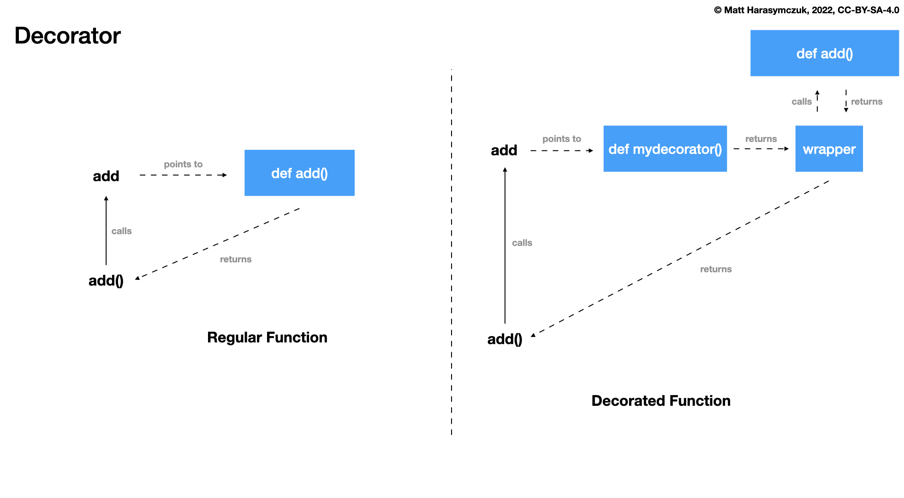

Decorator About
===============
* Decorator is an object, which takes another object as it's argument
* Since Python 2.4: :pep:`318` -- Decorators for Functions and Methods
* Since Python 3.9: :pep:`614` -- Relaxing Grammar Restrictions On Decorators
* Decorator can do things before call
* Decorator can do things after call
* Decorator can modify arguments
* Decorator can modify returned value
* Decorator can avoid calling
* Decorator can modify globals
* Decorator can add or change metadata

In Python, a decorator is a function that modifies the behavior of another
function. It takes a function as input and returns a modified version of
that function. Decorators are a powerful feature of Python that allows you
to add functionality to a function without modifying its source code.

Decorators are defined using the "@" symbol followed by the name of the
decorator function. When a function is decorated, the decorator function is
called with the original function as its argument. The decorator function
can then modify the behavior of the original function by adding new
functionality or modifying its existing behavior.

Here is an example of a simple decorator that adds a greeting to a function:

>>> def greeting_decorator(func):
...     def wrapper():
...         print('Before')
...         func()
...         print('After')
...     return wrapper
>>>
>>> @greeting_decorator
... def my_function():
...     print('This is my function.')
>>>
>>> my_function()
Before
This is my function.
After

In this example, the ``greeting_decorator`` function takes a function as input
and returns a new function ``wrapper`` that adds a greeting before and after
calling the original function. The ``@greeting_decorator`` syntax is used to
apply the decorator to the ``my_function`` function. When ``my_function`` is
called, it will now print "Before", execute its original code, and then
print "After".

Syntax
------
* ``func`` is a reference to function which is being decorated
* ``args`` arbitrary number of positional arguments
* ``kwargs`` arbitrary number of keyword arguments
* By calling ``func(*args, **kwargs)`` you actually run original (wrapped) function with it's original arguments

>>> def mydecorator(func):
...     def wrapper(*args, **kwargs):
...         return func(*args, **kwargs)
...     return wrapper
>>>
>>>
>>> @mydecorator
... def myfunction(*args, **kwargs):
...     pass
>>>
>>>
>>> myfunction()

Decoration
----------
Syntax:

>>> @mydecorator
... def myfunction(*args, **kwargs):
...     ...

Is equivalent to:

>>> myfunction = mydecorator(myfunction)
