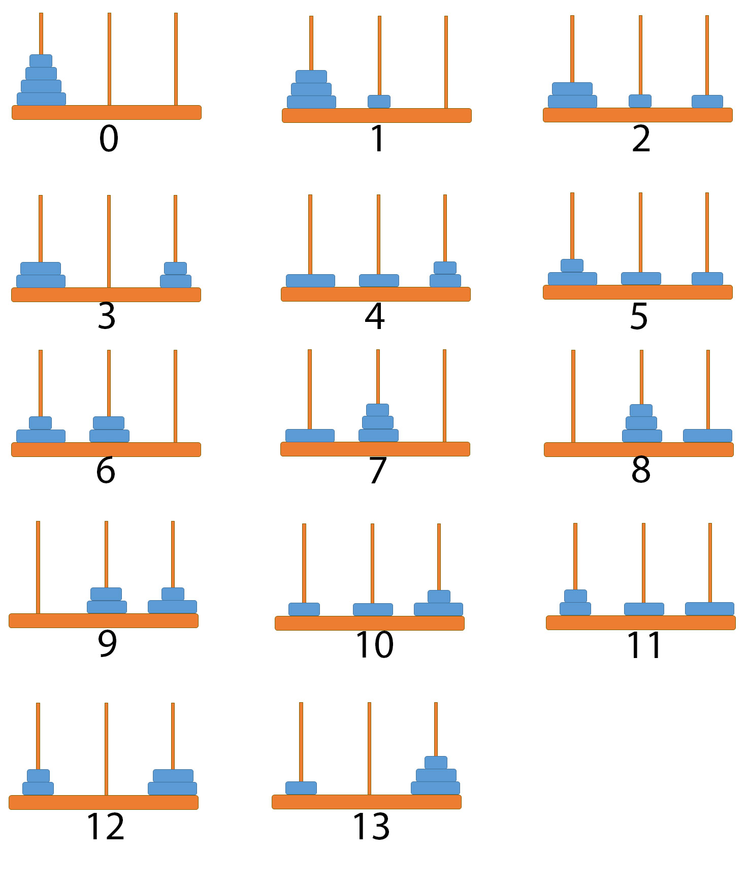

Functional Recurrence
=====================
* Also known as recursion
* Iteration in functional languages is usually accomplished via recursion
* Recursive functions invoke themselves
* Operation is repeated until it reaches the base case
* In general, recursion requires maintaining a stack, which consumes space
  in a linear amount to the depth of recursion.
* This could make recursion prohibitively expensive to use instead of
  imperative loops.
* However, a special form of recursion known as tail recursion can be
  recognized and optimized by a compiler into the same code used to
  implement iteration in imperative languages.
* Tail recursion optimization can be implemented by transforming the
  program into continuation passing style during compiling, among other
  approaches. [#WikipediaFunc]_

.. epigraph::

    Aby zrozumieć rekurencję – musisz najpierw zrozumieć rekurencję.

.. epigraph::

    In order to understand recursion, you must understand recursion. [#Hunter2011]_

In the functional programming paradigm, there are no for and while loops.
Instead, these languages rely on recursion for iteration. Recursion is
implemented using recursive functions, which call themselves repeatedly
until the base case is reached.

Recurrence in Python
--------------------
* Python isn't a functional language
* CPython implementation doesn't optimize tail recursion
* Tail recursion is not a particularly efficient technique in Python
* Rewriting the algorithm iteratively, is generally a better idea
* Uncontrolled recursion causes stack overflows!

Example
-------
Recap information about factorial (``n!``):

.. code-block:: text

    5! = 5 * 4!
    4! = 4 * 3!
    3! = 3 * 2!
    2! = 2 * 1!
    1! = 1 * 0!
    0! = 1

.. code-block:: text

    n! = n * (n-1)!  # 0! = 1

>>> def factorial(n):
...     if n == 0:
...         return 1
...     else:
...         return n * factorial(n-1)

.. code-block:: python

    factorial(5)                                    # = 120
        return 5 * factorial(4)                     # 5 * 24 = 120
            return 4 * factorial(3)                 # 4 * 6 = 24
                return 3 * factorial(2)             # 3 * 2 = 6
                    return 2 * factorial(1)         # 2 * 1 = 2
                        return 1 * factorial(0)     # 1 * 1 = 1
                            return 1                # 1

Recursion Depth Limit
---------------------
* Default recursion depth limit is 1000
* Warning: Anaconda sets default recursion depth limit to 2000

>>> import sys
>>>
>>> sys.setrecursionlimit(3000)

Notation
--------
>>> def factorial(n):
...     if n == 0:
...         return 1
...     return n * factorial(n-1)

>>> def factorial(n):
...     return n * factorial(n-1) if n else 1

>>> def factorial(n):
...     return 1 if n == 0 else n * factorial(n-1)

>>> def factorial(n):
...     return 1 if n==0 else n*factorial(n-1)

Memoization
-----------
>>> CACHE = {}
>>>
>>> def factorial(n):
...     if n not in CACHE:
...         CACHE[n] = 1 if n==0 else n*factorial(n-1)
...     return CACHE[n]

>>> factorial(5)
120
>>>
>>> factorial(6)
720
>>>
>>> CACHE
{0: 1, 1: 1, 2: 2, 3: 6, 4: 24, 5: 120, 6: 720}

>>> factorial(5)
120
>>>
>>> CACHE[5]
120
>>>
>>> 5 * CACHE[4]
120

Performance
-----------
>>> def factorial(n):
...     return 1 if n==0 else n*factorial(n-1)
...
>>>
>>> %%timeit -n 1000 -r 1000  # doctest: +SKIP
... factorial(19)
... factorial(20)
...
11.2 µs ± 703 ns per loop (mean ± std. dev. of 1000 runs, 1,000 loops each)

>>> CACHE = {}
>>>
>>> def factorial(n):
...     if n not in CACHE:
...         CACHE[n] = 1 if n==0 else n*factorial(n-1)
...     return CACHE[n]
...
>>>
>>> %%timeit -n 1000 -r 1000  # doctest: +SKIP
... factorial(19)
... factorial(20)
...
253 ns ± 74.4 ns per loop (mean ± std. dev. of 1000 runs, 1,000 loops each)

>>> CACHE  # doctest: +SKIP
{0: 1,
 1: 1,
 2: 2,
 3: 6,
 4: 24,
 5: 120,
 6: 720,
 7: 5040,
 8: 40320,
 9: 362880,
 10: 3628800,
 11: 39916800,
 12: 479001600,
 13: 6227020800,
 14: 87178291200,
 15: 1307674368000,
 16: 20922789888000,
 17: 355687428096000,
 18: 6402373705728000,
 19: 121645100408832000,
 20: 2432902008176640000}

>>> factorial(20)
2432902008176640000

>>> factorial(21)
51090942171709440000

>>> 21 * factorial(20)
51090942171709440000

Use Case - 0x01
---------------

    Hanoi Tower as a standard example of a recurrence. Source: [#hanoi]_

References
----------
.. [#WikipediaFunc] Functional programming. Retrieved: 2020-10-09. URL: https://en.wikipedia.org/wiki/Functional_programming
.. [#hanoi] https://dyermath.files.wordpress.com/2015/06/hanoi-13.jpg

.. [#Hunter2011] Hunter, David (2011). Essentials of Discrete Mathematics. Jones and Bartlett. p. 494. ISBN 9781449604424.

Assignments
-----------
.. literalinclude:: assignments/functional_recurrence_a.py
    :caption: :download:`Solution <assignments/functional_recurrence_a.py>`
    :end-before: # Solution
