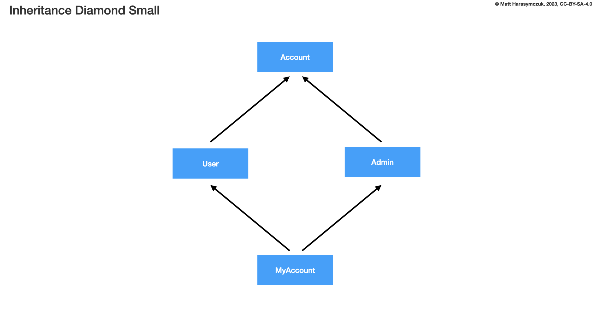
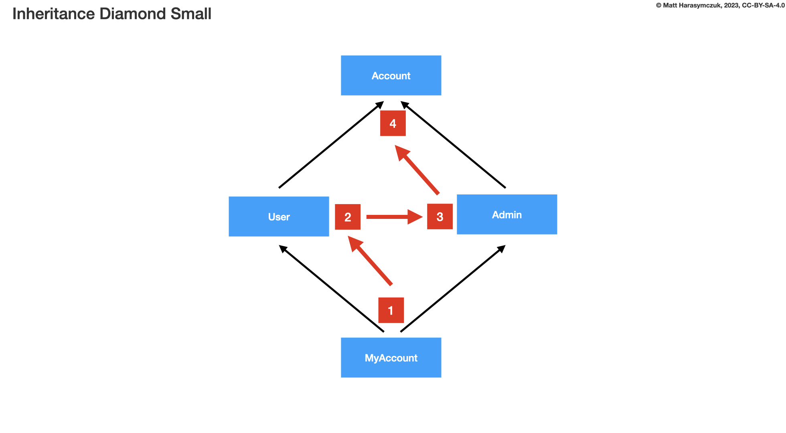
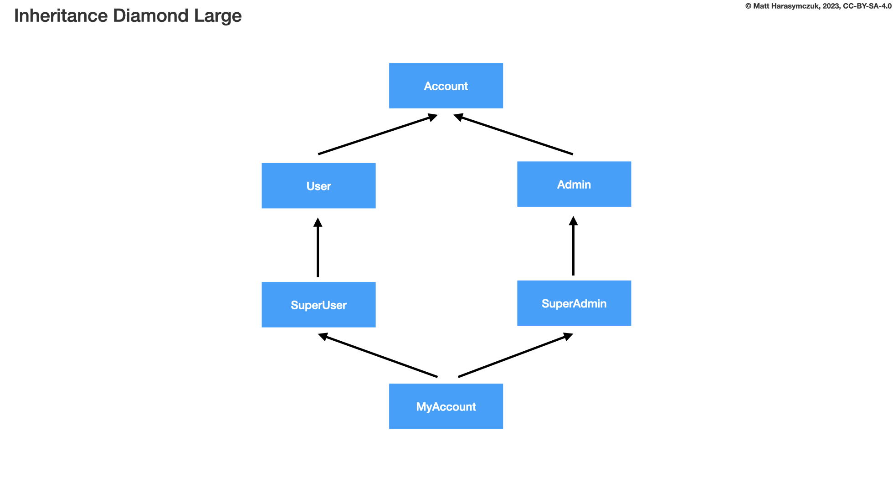
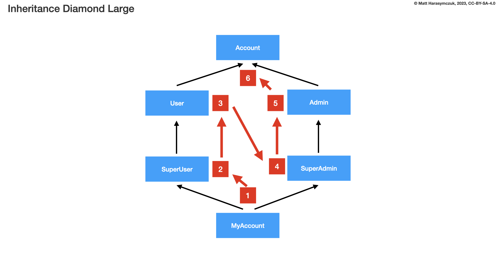
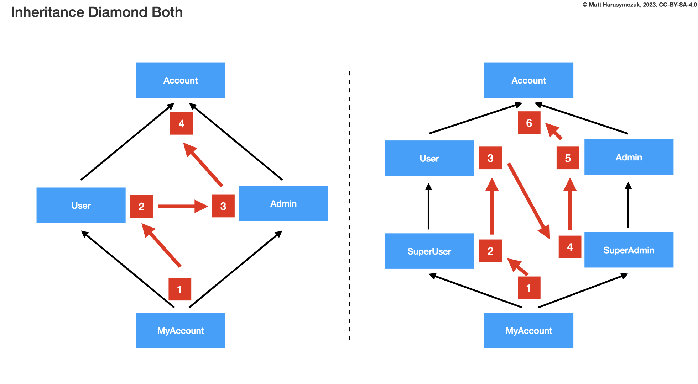
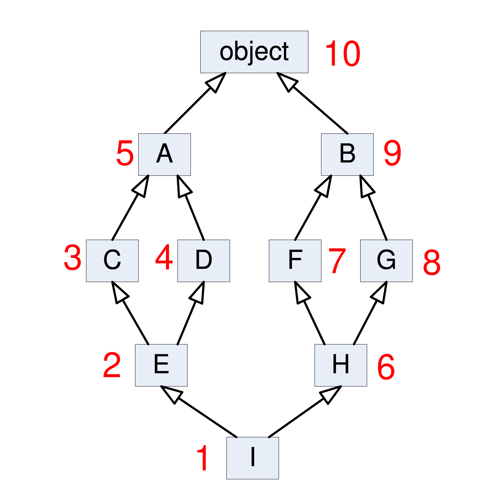
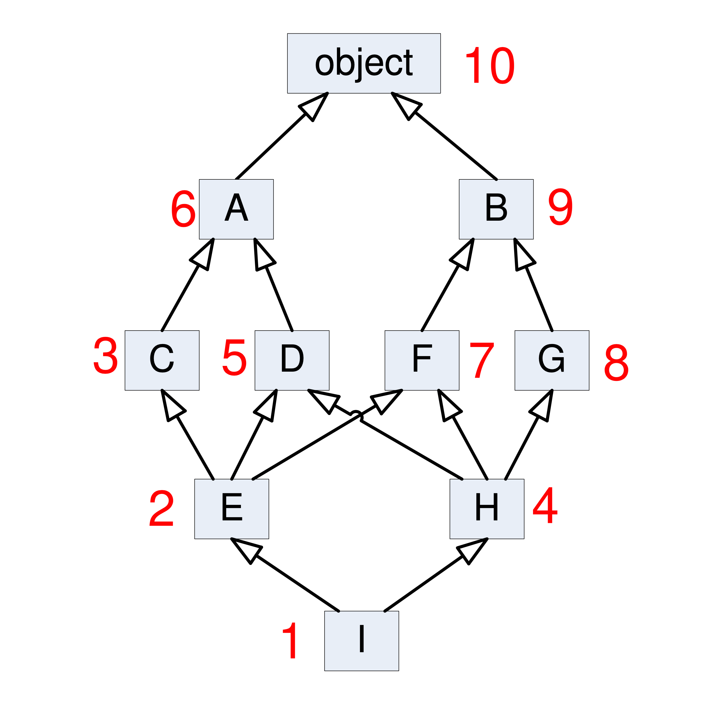

OOP Inheritance MRO
===================
* MRO - Method Resolution Order
* Inheritance Diamond

Python computes a method resolution order (MRO) based on your class
inheritance tree. The MRO satisfies 3 properties:

* Children of a class come before their parents
* User parents come before Admin parents
* A class only appears once in the MRO

If no such ordering exists, Python errors. The inner workings of this
is a C3 Linerization of the classes ancestry. Read all about it here:
https://www.python.org/download/releases/2.3/mro/

.. code-block:: text

      Account
       /   \
      /     \
    User   Admin
      \     /
       \   /
     MyAccount

Thus, in examples above, it is:

* MyAccount
* User
* Admin
* Account

When a method is called, the first occurrence of that method in the MRO
is the one that is called. Any class that doesn't implement that method
is skipped. Any call to ``super()`` within that method will call the next
occurrence of that method in the MRO. Consequently, it matters both what
order you place classes in inheritance, and where you put the calls to
super in the methods.

Note that you can see the MRO in python by using the ``.mro()`` method:

>>> class Account(object):
...     pass
>>>
>>> class User(Account):
...     pass
>>>
>>> class Admin(Account):
...     pass
>>>
>>> class MyAccount(User, Admin):
...     pass

>>> MyAccount.mro()  # doctest: +NORMALIZE_WHITESPACE
[<class '__main__.MyAccount'>,
 <class '__main__.User'>,
 <class '__main__.Admin'>,
 <class '__main__.Account'>,
 <class 'object'>]

Note that in Python 3, you don't need to pass any arguments to ``super()``,
it can figure out which class it is being called from and work automatically.
In Python 2 you had to specify the current class, but that's not needed
any more.

.. note:: Source [#StackOverflowSuper]_ [#vanRossum2020]_

Problem
-------
>>> class Account:
...     def __init__(self):
...         print('Account')
>>>
>>>
>>> class User(Account):
...     def __init__(self):
...         print('User')
>>>
>>>
>>> class Admin(Account):
...     def __init__(self):
...         print('Admin')
>>>
>>>
>>> class MyAccount(User, Admin):
...     def __init__(self):
...         print('MyAccount')
>>>
>>>
>>> me = MyAccount()
MyAccount

Small Diamond
-------------

>>> class Account:
...     def __init__(self):
...         print('Account')
>>>
>>>
>>> class User(Account):
...     def __init__(self):
...         print('User')
>>>
>>>
>>> class Admin(Account):
...     def __init__(self):
...         print('Admin')
>>>
>>>
>>> class MyAccount(User, Admin):
...     pass
>>>
>>>
>>> me = MyAccount()
User

>>> class Account:
...     def __init__(self):
...         print('Account')
>>>
>>>
>>> class User(Account):
...     def __init__(self):
...         print('User')
>>>
>>>
>>> class Admin(Account):
...     def __init__(self):
...         print('Admin')
>>>
>>>
>>> class MyAccount(User, Admin):
...     def __init__(self):
...         super().__init__()
>>>
>>>
>>> me = MyAccount()
User

>>> MyAccount.mro()  # doctest: +NORMALIZE_WHITESPACE
[<class '__main__.MyAccount'>,
 <class '__main__.User'>,
 <class '__main__.Admin'>,
 <class '__main__.Account'>,
 <class 'object'>]

>>> MyAccount.__mro__  # doctest: +NORMALIZE_WHITESPACE
(<class '__main__.MyAccount'>,
 <class '__main__.User'>,
 <class '__main__.Admin'>,
 <class '__main__.Account'>,
 <class 'object'>)

Large Diamond
-------------

>>> class Account:
...     def __init__(self):
...         print('Account')
>>>
>>>
>>> class User(Account):
...     def __init__(self):
...         print('User')
>>>
>>> class SuperUser(User):
...     def __init__(self):
...         print('SuperUser')
>>>
>>>
>>> class Admin(Account):
...     def __init__(self):
...         print('Admin')
>>>
>>> class SuperAdmin(Admin):
...     def __init__(self):
...         print('SuperAdmin')
>>>
>>>
>>> class MyAccount(SuperUser, SuperAdmin):
...     def __init__(self):
...         super().__init__()
>>>
>>>
>>> me = MyAccount()
SuperUser

>>> class Account:
...     def __init__(self):
...         print('Account')
>>>
>>>
>>> class User(Account):
...     def __init__(self):
...         print('User')
>>>
>>> class SuperUser(User):
...     def __init__(self):
...         super().__init__()
...         print('SuperUser')
>>>
>>>
>>> class Admin(Account):
...     def __init__(self):
...         print('Admin')
>>>
>>> class SuperAdmin(Admin):
...     def __init__(self):
...         super().__init__()
...         print('SuperAdmin')
>>>
>>>
>>> class MyAccount(SuperUser, SuperAdmin):
...     pass
>>>
>>>
>>> me = MyAccount()
User
SuperUser

Problematic super()
-------------------
>>> class Account:
...     def __init__(self):
...         print('Account')
>>>
>>>
>>> class User(Account):
...     def __init__(self):
...         print('User')
...         super().__init__()
>>>
>>> class SuperUser(User):
...     def __init__(self):
...         print('SuperUser')
...         super().__init__()
>>>
>>>
>>> class Admin(Account):
...     def __init__(self):
...         print('Admin')
...         super().__init__()
>>>
>>> class SuperAdmin(Admin):
...     def __init__(self):
...         print('SuperAdmin')
...         super().__init__()
>>>
>>>
>>> class MyAccount(SuperUser, SuperAdmin):
...     pass
>>>
>>>
>>> me = MyAccount()
SuperUser
User
SuperAdmin
Admin
Account

Why?!
-----
* Raymond Hettinger - Super considered super! - PyCon 2015 [#Hettinger2015]_

>>> MyAccount.mro()  # doctest: +NORMALIZE_WHITESPACE
[<class '__main__.MyAccount'>,
 <class '__main__.SuperUser'>,
 <class '__main__.User'>,
 <class '__main__.SuperAdmin'>,
 <class '__main__.Admin'>,
 <class '__main__.Account'>,
 <class 'object'>]

Compare
-------

Advanced
--------
* Source: [#Halterman2018]_
* Source: [#StackOverflowMRO]_

>>> class A: ...
>>> class B: ...
>>> class C(A): ...
>>> class D(A): ...
>>> class E(C, D): ...
>>> class F(B): ...
>>> class G(B): ...
>>> class H(F, G): ...
>>> class I(E, H): ...

>>> I.mro()  # doctest: +NORMALIZE_WHITESPACE
[<class '__main__.I'>,
 <class '__main__.E'>,
 <class '__main__.C'>,
 <class '__main__.D'>,
 <class '__main__.A'>,
 <class '__main__.H'>,
 <class '__main__.F'>,
 <class '__main__.G'>,
 <class '__main__.B'>,
 <class 'object'>]

Note that a class X will be visited only if all its sub-classes, which
inherit from it, have been visited(i.e., you should never visit a class
that has an arrow coming into it from a class below that you have not
yet visited).

Here, note that after visiting class ``C`` , ``D`` is visited although
``C`` and ``D`` DO NOT have is a relationship between them (but both have
with ``A``). This is where ``super()`` differs from single inheritance.

Consider a slightly more complicated example:

>>> class A: ...
>>> class B: ...
>>> class C(A): ...
>>> class D(A): ...
>>> class E(C, D, F): ...
>>> class F(B): ...
>>> class G(B): ...
>>> class H(D, F, G): ...
>>> class I(E, H): ...

>>> I.mro()  # doctest: +NORMALIZE_WHITESPACE
[<class '__main__.I'>,
 <class '__main__.E'>,
 <class '__main__.C'>,
 <class '__main__.H'>,
 <class '__main__.D'>,
 <class '__main__.A'>,
 <class '__main__.F'>,
 <class '__main__.B'>,
 <class '__main__.F'>,
 <class '__main__.G'>,
 <class '__main__.B'>,
 <class 'object'>]

In this case we proceed from ``I`` to ``E`` to ``C``. The next step up
would be ``A``, but we have yet to visit ``D``, a subclass of ``A``.
We cannot visit ``D``, however, because we have yet to visit ``H``,
a subclass of ``D``. The leaves ``H`` as the next class to visit.
Remember, we attempt to go up in hierarchy, if possible, so we visit
its leftmost superclass, ``D``. After ``D`` we visit ``A``, but we cannot
go up to object because we have yet to visit ``F``, ``G``, and ``B``.
These classes, in order, round out the MRO for ``I``.

Note that no class can appear more than once in MRO.

This is how ``super()`` looks up in the hierarchy of inheritance.

Ambiguous MRO
-------------
If Python cannot find a coherent method resolution order, it'll raise
an exception, instead of falling back to behavior which might surprise
the user.

>>> class First:
...     pass
>>>
>>> class Second(First):
...     pass
>>>
>>> class Third(First, Second):
...     pass
Traceback (most recent call last):
TypeError: Cannot create a consistent method resolution
order (MRO) for bases First, Second

Should ``Third``'s MRO be ``[First, Second]`` or ``[Second, First]``?
There's no obvious expectation, and Python will raise an error.

Further Reading
---------------
* van Rossum, G. Method Resolution Order. Year: 2010. Retrieved: 2022-07-13. URL: http://python-history.blogspot.com/2010/06/method-resolution-order.html

* Hettinger R. Super considered super!. PyCon 2015. Year: 2020. Retrieved: 2022-07-13. URL: https://www.youtube.com/watch?v=EiOglTERPEo

References
----------
.. [#vanRossum2020] van Rossum, G. Method Resolution Order. Year: 2010. Retrieved: 2022-07-13. URL: http://python-history.blogspot.com/2010/06/method-resolution-order.html
.. [#Hettinger2015] Hettinger R. Super considered super!. PyCon 2015. Year: 2020. Retrieved: 2022-07-13. URL: https://www.youtube.com/watch?v=EiOglTERPEo
.. [#Halterman2018] Halterman, R.L. Fundamentals of Python Programming. Publisher: Southern Adventist University. Year: 2018.
.. [#StackOverflowMRO] T.M15. How does Python's super() work with multiple inheritance? Year: 2020. Retrieved: 2022-07-13. URL: https://stackoverflow.com/a/62753514
.. [#StackOverflowSuper] Zags. How does Python's super() work with multiple inheritance? Year: 2017. Retrieved: 2022-07-13. URL: https://stackoverflow.com/a/46286174

Assignments
-----------
.. todo:: Assignments
