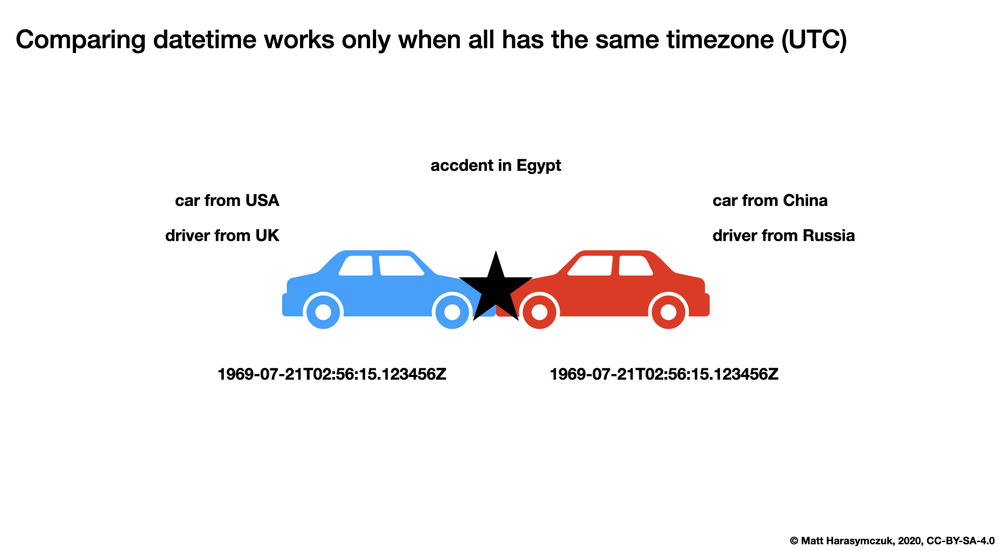

Protocol Descriptor
===================
* Add managed attributes to objects
* Outsource functionality into specialized classes
* Descriptors: ``classmethod``, ``staticmethod``, ``property``, functions in general
* ``__del__(self)`` is reserved when object is being deleted by garbage collector (destructor)
* ``__set_name()`` After class creation, Python default metaclass will call it with cls and classname

Descriptors are a powerful feature in Python that allow you to customize the
behavior of attribute access on a class. They are used to define how an
attribute is accessed, set, or deleted on an instance of a class.

In Python, every attribute access on an object is handled by a descriptor. A
descriptor is an object that defines one or more of the following methods:

* ``__get__(self, instance, owner)`` - used to get the value of the attribute.
* ``__set__(self, instance, value)`` - used to set the value of the attribute.
* ``__delete__(self, instance)`` - used to delete the attribute.

Descriptors can be used to implement a variety of features, such as lazy
evaluation of attributes, type checking, and data validation. They are
commonly used in frameworks like Django and Flask to provide database access
and validation of user input.

Protocol
--------
* ``__get__(self, cls, *args) -> self``
* ``__set__(self, cls, value) -> None``
* ``__delete__(self, cls) -> None``
* ``__set_name__(self)``

.. epigraph::

    If any of those methods are defined for an object, it is said to be a descriptor.

    -- Raymond Hettinger

>>> class Descriptor:
...     def __get__(self, cls, *args):
...         return ...
...
...     def __set__(self, cls, value):
...         ...
...
...     def __delete__(self, cls):
...         ...
...
...     def __set_name__(self, cls, attrname):
...         ...

Example
-------
>>> class MyField:
...     def __get__(self, cls, *args):
...         print('Getter')
...
...     def __set__(self, cls, value):
...         print('Setter')
...
...     def __delete__(self, cls):
...         print('Deleter')
>>>
>>>
>>> class MyClass:
...     value = MyField()
>>>
>>>
>>> my = MyClass()
>>>
>>> my.value = 'something'
Setter
>>>
>>> my.value
Getter
>>>
>>> del my.value
Deleter

Property vs Reflection vs Descriptor
------------------------------------
Property:

>>> class Temperature:
...     kelvin = property()
...     _value: float
...
...     @kelvin.setter
...     def myattribute(self, value):
...         if value < 0:
...             raise ValueError
...         else:
...             self._value = value

Reflection:

>>> class Temperature:
...     kelvin: float
...
...     def __setattr__(self, attrname, value):
...         if attrname == 'kelvin' and value < 0:
...             raise ValueError
...         else:
...             super().__setattr__(attrname, value)

Descriptor:

>>> class Kelvin:
...     def __set__(self, cls, value):
...         if value < 0:
...             raise ValueError
...         else:
...             cls._value = value
>>>
>>>
>>> class Temperature:
...     kelvin = Kelvin()
...     _value: float

Inheritance
-----------

Function Descriptor
-------------------
* Function are Descriptors too

>>> def hello():
...     pass
>>>
>>>
>>> type(hello)
<class 'function'>
>>> hasattr(hello, '__get__')
True
>>> hasattr(hello, '__set__')
False
>>> hasattr(hello, '__delete__')
False
>>> hasattr(hello, '__set_name__')
False
>>> dir(hello)  # doctest: +NORMALIZE_WHITESPACE
['__annotations__', '__builtins__', '__call__', '__class__', '__closure__',
 '__code__', '__defaults__', '__delattr__', '__dict__', '__dir__', '__doc__',
 '__eq__', '__format__', '__ge__', '__get__', '__getattribute__',
 '__getstate__', '__globals__', '__gt__', '__hash__', '__init__',
 '__init_subclass__', '__kwdefaults__', '__le__', '__lt__', '__module__',
 '__name__', '__ne__', '__new__', '__qualname__', '__reduce__',
 '__reduce_ex__', '__repr__', '__setattr__', '__sizeof__', '__str__',
 '__subclasshook__']

>>> class User:
...     def hello(self):
...         pass
>>>
>>> type(User.hello)
<class 'function'>
>>> hasattr(User.hello, '__get__')
True
>>> hasattr(User.hello, '__set__')
False
>>> hasattr(User.hello, '__delete__')
False
>>> hasattr(User.hello, '__set_name__')
False
>>> dir(User.hello)  # doctest: +NORMALIZE_WHITESPACE
['__annotations__', '__builtins__', '__call__', '__class__', '__closure__',
 '__code__', '__defaults__', '__delattr__', '__dict__', '__dir__', '__doc__',
 '__eq__', '__format__', '__ge__', '__get__', '__getattribute__',
 '__getstate__', '__globals__', '__gt__', '__hash__', '__init__',
 '__init_subclass__', '__kwdefaults__', '__le__', '__lt__', '__module__',
 '__name__', '__ne__', '__new__', '__qualname__', '__reduce__',
 '__reduce_ex__', '__repr__', '__setattr__', '__sizeof__', '__str__',
 '__subclasshook__']

>>> class User:
...     def hello(self):
...         pass
>>>
>>> mark = User()
>>>
>>> type(mark.hello)
<class 'method'>
>>> hasattr(mark.hello, '__get__')
True
>>> hasattr(mark.hello, '__set__')
False
>>> hasattr(mark.hello, '__delete__')
False
>>> hasattr(mark.hello, '__set_name__')
False
>>> dir(mark.hello)  # doctest: +NORMALIZE_WHITESPACE
['__call__', '__class__', '__delattr__', '__dir__', '__doc__', '__eq__',
 '__format__', '__func__', '__ge__', '__getattribute__', '__getstate__',
 '__gt__', '__hash__', '__init__', '__init_subclass__', '__le__', '__lt__',
 '__ne__', '__new__', '__reduce__', '__reduce_ex__', '__repr__', '__self__',
 '__setattr__', '__sizeof__', '__str__', '__subclasshook__']

Use Case - 0x01
---------------
* Kelvin Temperature Validator

>>> class KelvinValidator:
...     def __set__(self, cls, value):
...         if value < 0.0:
...             raise ValueError('Cannot set negative Kelvin')
...         cls._value = value
>>>
>>>
>>> class Temperature:
...     kelvin = KelvinValidator()
...
...     def __init__(self):
...         self._value = None
>>>
>>>
>>> t = Temperature()
>>> t.kelvin = -1
Traceback (most recent call last):
ValueError: Cannot set negative Kelvin

Use Case - 0x02
---------------
* Temperature Conversion

>>> class Kelvin:
...     def __get__(self, cls, *args):
...         return round(cls._value, 2)
...
...     def __set__(self, cls, value):
...         cls._value = value
>>>
>>>
>>> class Celsius:
...     def __get__(self, cls, *args):
...         value = cls._value - 273.15
...         return round(value, 2)
...
...     def __set__(self, cls, value):
...         cls._value = value + 273.15
>>>
>>>
>>> class Fahrenheit:
...     def __get__(self, cls, *args):
...         value = (cls._value - 273.15) * 9 / 5 + 32
...         return round(value, 2)
...
...     def __set__(self, cls, fahrenheit):
...         cls._value = (fahrenheit - 32) * 5 / 9 + 273.15
>>>
>>>
>>> class Temperature:
...     kelvin = Kelvin()
...     celsius = Celsius()
...     fahrenheit = Fahrenheit()
...
...     def __init__(self):
...         self._value = 0.0
>>>
>>>
>>> t = Temperature()
>>>
>>> t.kelvin = 273.15
>>> print(t.kelvin)
273.15
>>> print(t.celsius)
0.0
>>> print(t.fahrenheit)
32.0
>>>
>>> t.fahrenheit = 100
>>> print(t.kelvin)
310.93
>>> print(t.celsius)
37.78
>>> print(t.fahrenheit)
100.0
>>>
>>> t.celsius = 100
>>> print(t.kelvin)
373.15
>>> print(t.celsius)
100.0
>>> print(t.fahrenheit)
212.0

Use Case - 0x03
---------------
* Value Range Descriptor

>>> class Between:
...     def __init__(self, min, max):
...         self.min = min
...         self.max = max
...
...     def __set_name__(self, cls, attrname):
...         self.attrname = f'_{attrname}'
...
...     def __set__(self, cls, value):
...         if not self.min <= value <= self.max:
...             field = self.attrname.removeprefix('_')
...             raise ValueError(f'Value of field "{field}" is not between {self.min} and {self.max}')
...         setattr(cls, self.attrname, value)
...
...     def __get__(self, cls, clstype):
...         return getattr(cls, self.attrname)
...
...     def __delete__(self, cls):
...         setattr(cls, self.attrname, None)
>>>
>>>
>>> class User:
...     firstname: str
...     lastname: str
...     age = Between(30, 50)
...     height = Between(150, 210)
...     weight = Between(50, 90)

>>> mark = User()
>>>
>>> mark.firstname = 'Mark'
>>> mark.lastname = 'Watney'
>>> mark.age = 42
>>> mark.height = 178.0
>>> mark.weight = 75.5

>>> mark.age = 18
Traceback (most recent call last):
ValueError: Value of field "age" is not between 30 and 50
>>>
>>> mark.weight = 100
Traceback (most recent call last):
ValueError: Value of field "weight" is not between 50 and 90
>>>
>>> mark.height = 220
Traceback (most recent call last):
ValueError: Value of field "height" is not between 150 and 210

Use Case - 0x04
---------------
* https://github.com/annotated-types/annotated-types

>>> import re
>>>
>>>
>>> class Validator:
...     def __set_name__(self, cls, attribute_name):
...         self.attrname_short = f'_{attribute_name}'
...         self.attrname_full = f'{cls.__name__}.{attribute_name}'
...
...     def __get__(self, cls, cls_type):
...         return getattr(cls, self.attrname_short)
...
...     def __delete__(self, cls):
...         setattr(cls, self.attrname_short, None)
>>>
>>>
>>> class Between(Validator):
...     def __init__(self, min, max):
...         self.min = min
...         self.max = max
...
...     def __set__(self, cls, value):
...         if self.min <= value < self.max:
...             setattr(cls, self.attrname_short, value)
...         else:
...             raise ValueError(f'{self.attrname_full} value: {value} '
...                              f'is not between {self.min} and {self.max}')
>>>
>>>
>>> class MaxLength(Validator):
...     def __init__(self, max_length):
...         self.max_length = max_length
...
...     def __set__(self, cls, value):
...         if len(value) <= self.max_length:
...             setattr(cls, self.attrname_short, value)
...         else:
...             raise ValueError(f'{self.attrname_full} value: {value} '
...                              f'is longer than {self.max_length}')
>>>
>>> class MatchesRegex(Validator):
...     def __init__(self, pattern):
...         self.pattern = pattern
...         self.regex = re.compile(pattern)
...
...     def __set__(self, cls, value):
...         if self.regex.match(value):
...             setattr(cls, self.attrname_short, value)
...         else:
...             raise ValueError(f'{self.attrname_full} value: {value} '
...                              f'does not match pattern: {self.pattern}')
>>>
>>>
>>> class User:
...     firstname: str = MaxLength(20)
...     lastname: str = MaxLength(30)
...     age: int = Between(30, 50)
...     height: float = Between(150, 210)
...     weight: float = Between(50, 90)
...     email: str = MatchesRegex('^[a-z]+@nasa.gov$')

>>> mark = User()
>>>
>>> mark.firstname = 'Mark'
>>> mark.lastname = 'Watney'
>>> mark.age = 42
>>> mark.height = 178.0
>>> mark.weight = 75.5
>>> mark.email = 'mwatney@nasa.gov'

>>> mark.firstname = 'MarkMarkMarkMarkMarkMark'
Traceback (most recent call last):
ValueError: User.firstname value: MarkMarkMarkMarkMarkMark is longer than 20

>>> mark.lastname = 'WatneyWatneyWatneyWatneyWatneyWatney'
Traceback (most recent call last):
ValueError: User.lastname value: WatneyWatneyWatneyWatneyWatneyWatney is longer than 30

>>> mark.age = 60
Traceback (most recent call last):
ValueError: User.age value: 60 is not between 30 and 50

>>> mark.height = 220
Traceback (most recent call last):
ValueError: User.height value: 220 is not between 150 and 210

>>> mark.weight = 100
Traceback (most recent call last):
ValueError: User.weight value: 100 is not between 50 and 90

>>> mark.email = 'invalid-email@nasa.gov'
Traceback (most recent call last):
ValueError: User.email value: invalid-email@nasa.gov does not match pattern: ^[a-z]+@nasa.gov$

Use Case - 0x05
---------------
>>> from abc import ABC, abstractmethod
>>> from dataclasses import InitVar, dataclass, field
>>> from typing import Any
>>> import re
>>>
>>>
>>> @dataclass
... class Validator(ABC):
...     attrname: str = field(init=False)
...
...     @property
...     @abstractmethod
...     def error(self) -> str:
...         raise NotImplementedError
...
...     @abstractmethod
...     def is_valid(self, value: Any) -> bool:
...         raise NotImplementedError
...
...     def __get__(self, instance, owner):
...         return getattr(instance, self.attrname)
...
...     def __set_name__(self, owner, name):
...         self.attrname = f'_{name}'
...
...     def __set__(self, instance, value):
...         if not self.is_valid(value):
...             raise ValueError(self.error.format(**vars(self)))
...         setattr(instance, self.attrname, value)
...
...
>>> @dataclass
... class String(Validator):
...     max_length: int
...     error: str = 'Value {attrname} is longer than {max_length}'
...
...     def is_valid(self, value) -> bool:
...         return len(value) <= self.max_length
...
...
>>> @dataclass
... class Integer(Validator):
...     min: int
...     max: int
...     error: str = 'Value {attrname} is not in range({min}, {max})'
...
...     def is_valid(self, value) -> bool:
...         return value in range(self.min, self.max)
...
...
>>> @dataclass
... class Select(Validator):
...     options: list[str]
...     error: str = 'Value {attrname} not in {options}'
...
...     def is_valid(self, value: Any) -> bool:
...         return value in self.options
...
>>> @dataclass
... class Email(Validator):
...     domain: str
...     error: str = 'Value {attrname} domain is not {domain}'
...
...     def is_valid(self, value) -> bool:
...         return value.endswith(self.domain)
...
...
>>> @dataclass
... class Regex(Validator):
...     regex: InitVar[str]
...     pattern: re.Match = field(default=None, init=False)
...     error: str = 'Value {attrname} does not match {pattern.pattern}'
...
...     def __post_init__(self, regex: str):
...         self.pattern = re.compile(regex)
...
...     def is_valid(self, value: Any) -> bool:
...         return self.pattern.match(value)

>>> class User:
...     firstname = String(max_length=10)
...     lastname = String(max_length=15)
...     age = Integer(min=0, max=130)
...     group = Select(options=['user', 'staff', 'admin'])
...     email = Email(domain='@nasa.gov')
...     phone = Regex('^\+1 \(\d{3}\) \d{3}-\d{4}$')

>>> mark = User()
>>> mark.firstname = 'Mark'
>>> mark.lastname = 'Watney'
>>> mark.email = 'mwatney@nasa.gov'
>>> mark.age = 41
>>> mark.group = 'user'
>>> mark.phone = '+1 (234) 567-8910'
>>>
>>> vars(mark)  # doctest: +NORMALIZE_WHITESPACE
{'_firstname': 'Mark',
 '_lastname': 'Watney',
 '_email': 'mwatney@nasa.gov',
 '_age': 41,
 '_group': 'user',
 '_phone': '+1 (234) 567-8910'}
>>>
>>> mark.firstname
'Mark'
>>> mark.lastname
'Watney'
>>> mark.email
'mwatney@nasa.gov'
>>> mark.age
41
>>> mark.group
'user'
>>> mark.phone
'+1 (234) 567-8910'

>>> mark.firstname = 'MarkMarkMarkMark'
Traceback (most recent call last):
ValueError: Value _firstname is longer than 10

>>> mark.lastname = 'WatneyWatneyWatneyWatneyWatney'
Traceback (most recent call last):
ValueError: Value _lastname is longer than 15

>>> mark.age = 135
Traceback (most recent call last):
ValueError: Value _age is not in range(0, 130)

>>> mark.group = 'editors'
Traceback (most recent call last):
ValueError: Value _group not in ['user', 'staff', 'admin']

>>> mark.email = 'mwatney@gmail.com'
Traceback (most recent call last):
ValueError: Value _email domain is not @nasa.gov

>>> mark.phone = '+48 123-456-789'
Traceback (most recent call last):
ValueError: Value _phone does not match ^\+1 \(\d{3}\) \d{3}-\d{4}$

>>> mark.phone = '+48 123.456.789'
Traceback (most recent call last):
ValueError: Value _phone does not match ^\+1 \(\d{3}\) \d{3}-\d{4}$

>>> mark.phone = '+48 asdas'
Traceback (most recent call last):
ValueError: Value _phone does not match ^\+1 \(\d{3}\) \d{3}-\d{4}$

>>> vars(User)  # doctest: +NORMALIZE_WHITESPACE
mappingproxy({'__module__': '__main__',
              'firstname': String(attrname='_firstname', max_length=10, error='Value {attrname} is longer than {max_length}'),
              'lastname': String(attrname='_lastname', max_length=15, error='Value {attrname} is longer than {max_length}'),
              'age': Integer(attrname='_age', min=0, max=130, error='Value {attrname} is not in range({min}, {max})'),
              'group': Select(attrname='_group', options=['user', 'staff', 'admin'], error='Value {attrname} not in {options}'),
              'email': Email(attrname='_email', domain='@nasa.gov', error='Value {attrname} domain is not {domain}'),
              'phone': Regex(attrname='_phone', pattern=re.compile('^\\+1 \\(\\d{3}\\) \\d{3}-\\d{4}$'), error='Value {attrname} does not match {pattern.pattern}'),
              '__dict__': <attribute '__dict__' of 'User' objects>,
              '__weakref__': <attribute '__weakref__' of 'User' objects>,
              '__doc__': None})

Use Case - 0x07
---------------
* Timezone Converter Descriptor

    Comparing datetime works only when all has the same timezone (UTC).
    More information in `Stdlib Datetime Timezone`

Descriptor Timezone Converter:

>>> from dataclasses import dataclass
>>> from datetime import datetime
>>> from zoneinfo import ZoneInfo
>>>
>>>
>>> class Timezone:
...     def __init__(self, name):
...         self.timezone = ZoneInfo(name)
...
...     def __get__(self, cls, *args):
...         utc = cls.utc.replace(tzinfo=ZoneInfo('UTC'))
...         return utc.astimezone(self.timezone)
...
...     def __set__(self, cls, new_datetime):
...         local_time = new_datetime.replace(tzinfo=self.timezone)
...         cls.utc = local_time.astimezone(ZoneInfo('UTC'))
>>>
>>>
>>> @dataclass
... class Time:
...     utc = datetime.now(tz=ZoneInfo('UTC'))
...     warsaw = Timezone('Europe/Warsaw')
...     eastern = Timezone('America/New_York')
...     pacific = Timezone('America/Los_Angeles')
>>>
>>>
>>> t = Time()
>>>
>>> # Gagarin's launch to space
>>> t.utc = datetime(1961, 4, 12, 6, 7)
>>>
>>> print(t.utc)
1961-04-12 06:07:00
>>> print(t.warsaw)
1961-04-12 07:07:00+01:00
>>> print(t.eastern)
1961-04-12 01:07:00-05:00
>>> print(t.pacific)
1961-04-11 22:07:00-08:00
>>>
>>>
>>> # Armstrong's first Lunar step
>>> t.warsaw = datetime(1969, 7, 21, 3, 56, 15)
>>>
>>> print(t.utc)
1969-07-21 02:56:15+00:00
>>> print(t.warsaw)
1969-07-21 03:56:15+01:00
>>> print(t.eastern)
1969-07-20 22:56:15-04:00
>>> print(t.pacific)
1969-07-20 19:56:15-07:00

Assignments
-----------
.. literalinclude:: assignments/protocol_descriptor_a.py
    :caption: :download:`Solution <assignments/protocol_descriptor_a.py>`
    :end-before: # Solution

.. literalinclude:: assignments/protocol_descriptor_b.py
    :caption: :download:`Solution <assignments/protocol_descriptor_b.py>`
    :end-before: # Solution

.. literalinclude:: assignments/protocol_descriptor_c.py
    :caption: :download:`Solution <assignments/protocol_descriptor_c.py>`
    :end-before: # Solution
