ORM Use Cases
=============

Base
----
>>> from dataclasses import dataclass
>>>
>>>
>>> @dataclass
... class Astronaut:
...     firstname: str
...     lastname: str
>>>
>>>
>>> CREW = [
...     Astronaut('Mark', 'Watney'),
...     Astronaut('Melissa', 'Lewis'),
...     Astronaut('Rick', 'Martinez')]

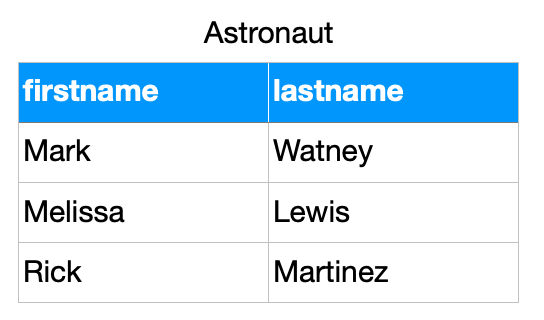

Extend
------
>>> from dataclasses import dataclass
>>>
>>>
>>> @dataclass
... class Astronaut:
...     firstname: str
...     lastname: str
...     role: str
>>>
>>>
>>> CREW = [
...     Astronaut('Mark', 'Watney', 'Botanist'),
...     Astronaut('Melissa', 'Lewis', 'Commander'),
...     Astronaut('Rick', 'Martinez', 'Pilot')]

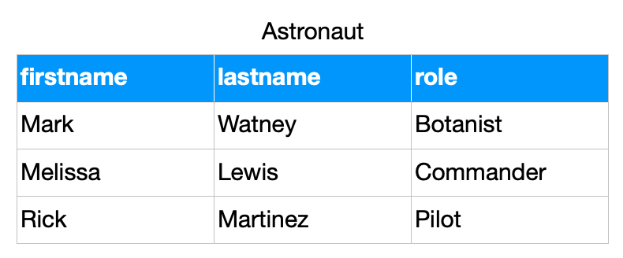

>>> from dataclasses import dataclass
>>>
>>>
>>> @dataclass
... class Astronaut:
...     firstname: str
...     lastname: str
...     role: str
...     mission_year: int
...     missions_name: str
>>>
>>>
>>> CREW = [
...     Astronaut('Mark', 'Watney', 'Botanist', 2035, 'Ares 3'),
...     Astronaut('Melissa', 'Lewis', 'Commander', 2035, 'Ares 3'),
...     Astronaut('Rick', 'Martinez', 'Pilot', 2035, 'Ares 3')]

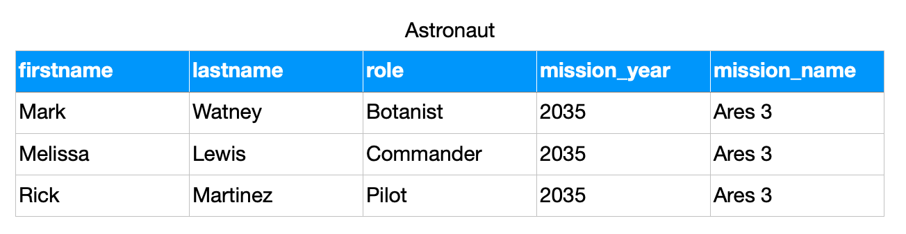

Boolean Vector
--------------
>>> from dataclasses import dataclass
>>>
>>>
>>> @dataclass
... class Mission:
...     year: int
...     name: str
>>>
>>>
>>> @dataclass
... class Astronaut:
...     firstname: str
...     lastname: str
...     role: str
...     missions: list[Mission]
>>>
>>>
>>> CREW = [
...     Astronaut('Mark', 'Watney', 'Botanist', missions=[
...         Mission(2035, 'Ares 3')]),
...     Astronaut('Melissa', 'Lewis', 'Commander', missions=[
...         Mission(2035, 'Ares 3'),
...         Mission(2031, 'Ares 1')]),
...     Astronaut('Rick', 'Martinez', 'Pilot', missions=[])]

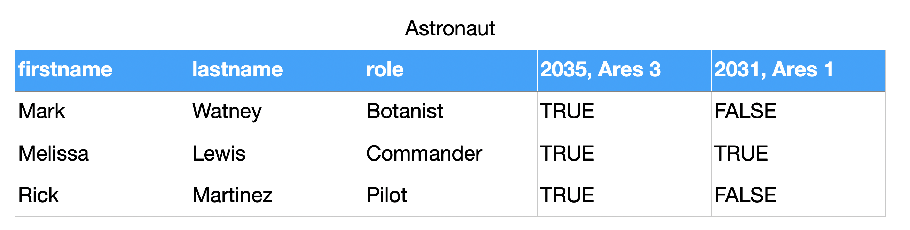

FFill
-----
>>> from dataclasses import dataclass
>>>
>>>
>>> @dataclass
... class Mission:
...     year: int
...     name: str
>>>
>>>
>>> @dataclass
... class Astronaut:
...     firstname: str
...     lastname: str
...     role: str
...     missions: list[Mission]
>>>
>>>
>>> CREW = [
...     Astronaut('Mark', 'Watney', 'Botanist', missions=[
...         Mission(2035, 'Ares 3')]),
...     Astronaut('Melissa', 'Lewis', 'Commander', missions=[
...         Mission(2035, 'Ares 3'),
...         Mission(2031, 'Ares 1')]),
...     Astronaut('Rick', 'Martinez', 'Pilot', missions=[])]

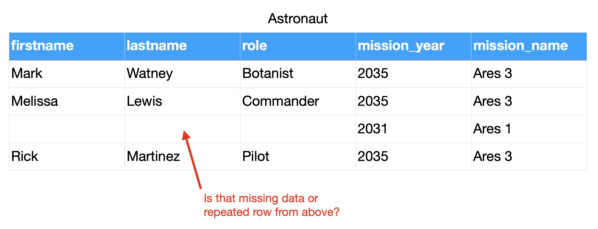
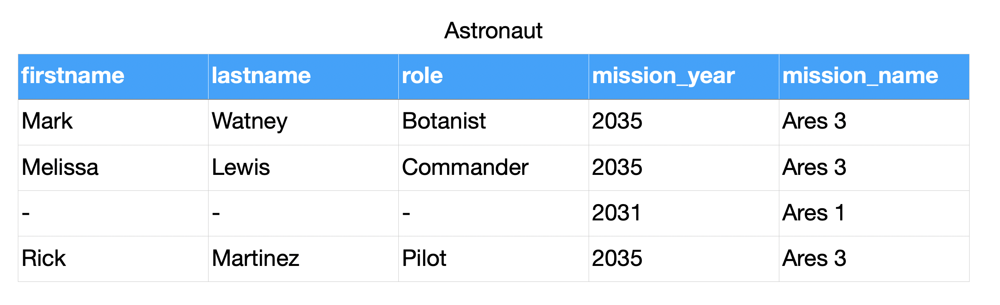
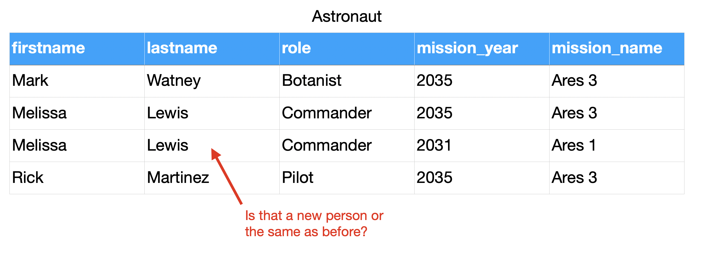
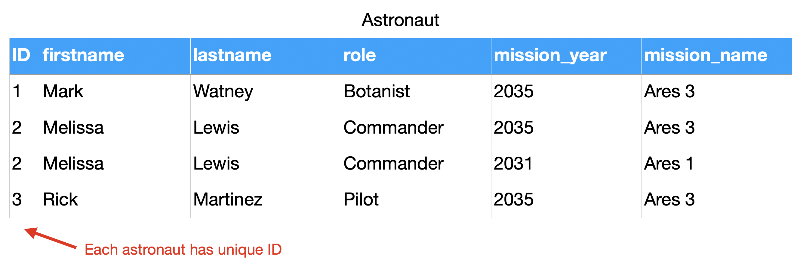

Relations
---------
>>> from dataclasses import dataclass
>>>
>>>
>>> @dataclass
... class Mission:
...     year: int
...     name: str
>>>
>>>
>>> @dataclass
... class Astronaut:
...     firstname: str
...     lastname: str
...     role: str
...     missions: list[Mission]
>>>
>>>
>>> CREW = [
...     Astronaut('Mark', 'Watney', 'Botanist', missions=[
...         Mission(2035, 'Ares 3')]),
...     Astronaut('Melissa', 'Lewis', 'Commander', missions=[
...         Mission(2035, 'Ares 3'),
...         Mission(2031, 'Ares 1')]),
...     Astronaut('Rick', 'Martinez', 'Pilot', missions=[])]

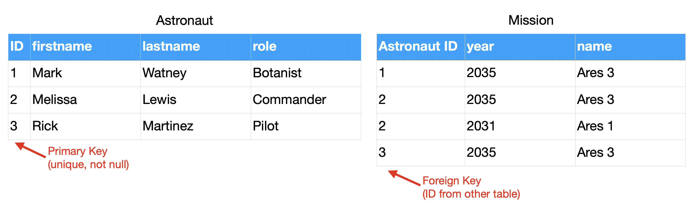
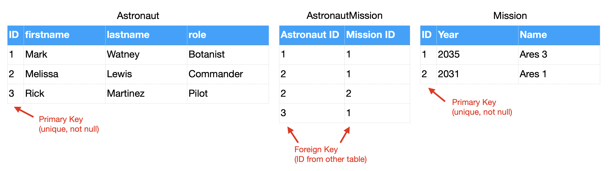

Serialization
-------------
>>> from dataclasses import dataclass
>>>
>>>
>>> @dataclass
... class Mission:
...     year: int
...     name: str
>>>
>>>
>>> @dataclass
... class Astronaut:
...     firstname: str
...     lastname: str
...     role: str
...     missions: list[Mission]
>>>
>>>
>>> CREW = [
...     Astronaut('Mark', 'Watney', 'Botanist', missions=[
...         Mission(2035, 'Ares 3')]),
...     Astronaut('Melissa', 'Lewis', 'Commander', missions=[
...         Mission(2035, 'Ares 3'),
...         Mission(2031, 'Ares 1')]),
...     Astronaut('Rick', 'Martinez', 'Pilot', missions=[])]

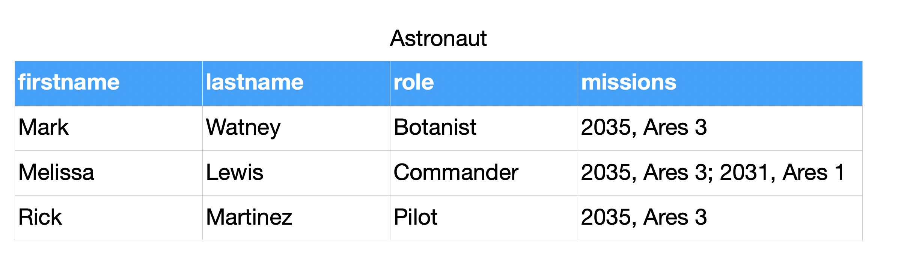
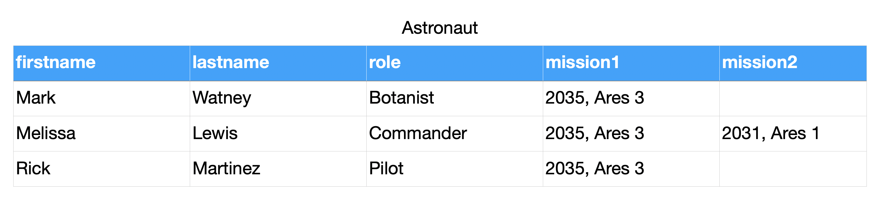
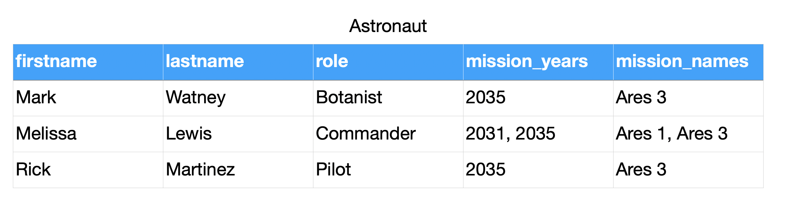
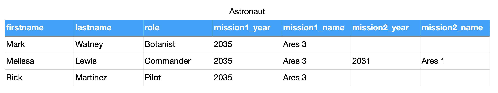
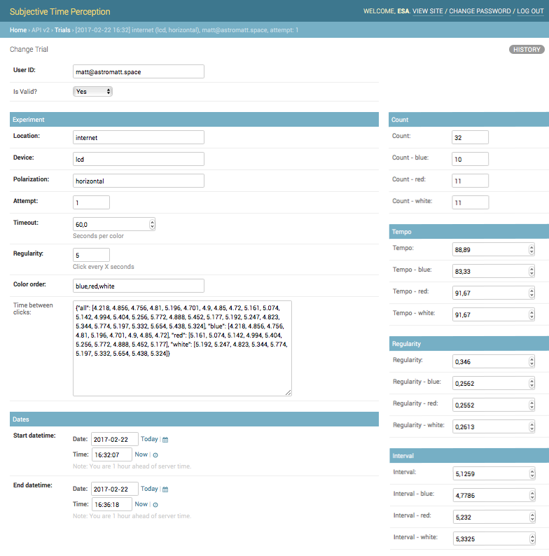

Recap
-----
* DBA and Programmers use different data format than Data Scientists
* Data Scientists prefer flat formats, without relations and joins
* DBA and Programmers prefer relational data
* For DBA and Programmers flat data formats represents data duplication
* Normalization make data manipulation more consistent
* Normalization uses less space and makes UPDATEs easier
* Normalization causes a lot of SELECT and JOINs, which requires computation
* In XXI century storage is cheap, computing power cost money
* Currently SELECTs are far more common than INSERTs and UPDATEs (let say
  80%-15%-5% - just a rough estimate, please don't quote this number)
* Normalization does not work at large (big-data) scale
* Big data requires simplified approach, and typically without any relations
* Data consistency then is achieved by business logic
