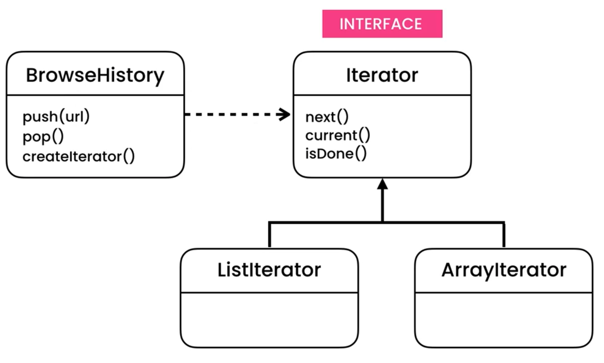

Iterator
========
* EN: Iterator
* PL: Iterator
* Type: object

Pattern
-------
* History (like browser history)

.. figure:: img/designpatterns-iterator-pattern.png

.. literalinclude:: uml/designpatterns-iterator-pattern.md
    :language: md

Problem
-------
.. figure:: img/designpatterns-iterator-problem.png

.. literalinclude:: uml/designpatterns-iterator-problem.md
    :language: md

.. literalinclude:: src/designpatterns-iterator-problem.py
    :language: python

Solution
--------

.. literalinclude:: uml/designpatterns-iterator-solution.md
    :language: md

.. literalinclude:: src/designpatterns-iterator-solution.py
    :language: python

Use Case - 0x01
---------------
.. literalinclude:: src/designpatterns-iterator-usecase-01.py
    :language: python

Use Case - 0x02
---------------
.. literalinclude:: src/designpatterns-iterator-usecase-02.py
    :language: python

Assignments
-----------
.. literalinclude:: assignments/designpatterns_iterator_a.py
    :caption: :download:`Solution <assignments/designpatterns_iterator_a.py>`
    :end-before: # Solution

.. literalinclude:: assignments/designpatterns_iterator_b.py
    :caption: :download:`Solution <assignments/designpatterns_iterator_b.py>`
    :end-before: # Solution

.. literalinclude:: assignments/designpatterns_iterator_c.py
    :caption: :download:`Solution <assignments/designpatterns_iterator_c.py>`
    :end-before: # Solution
