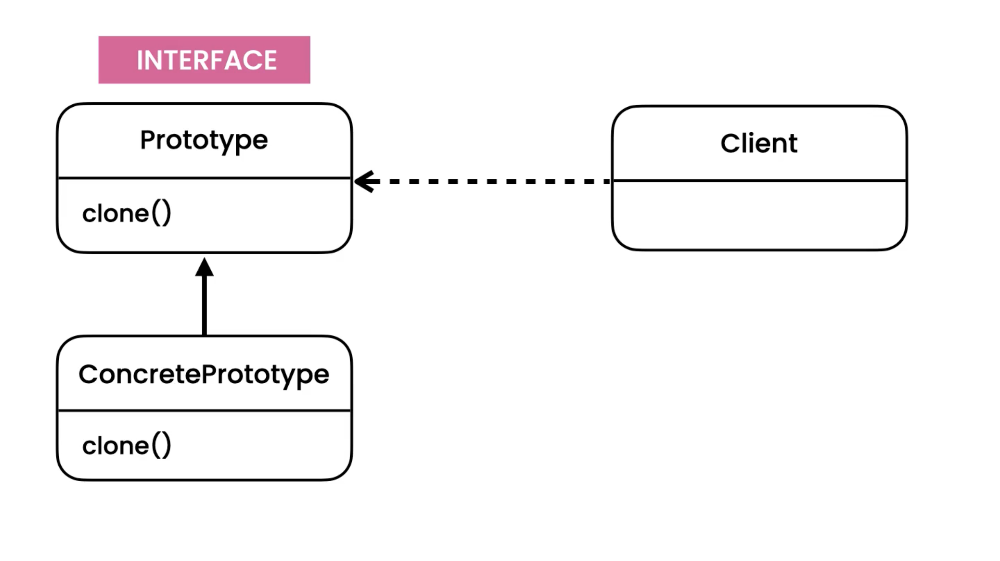
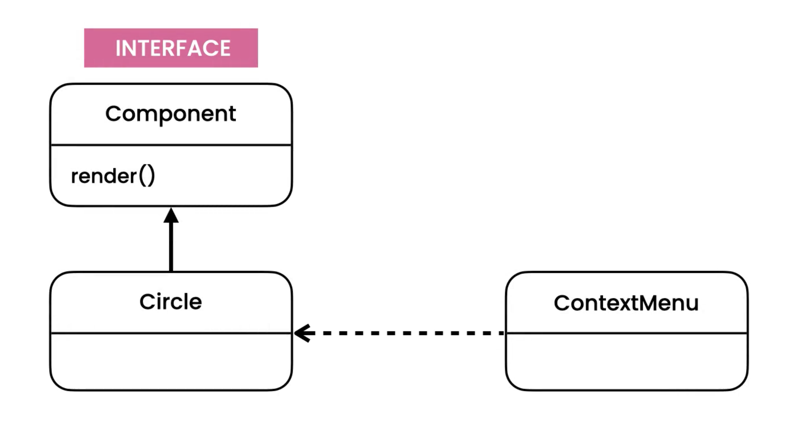
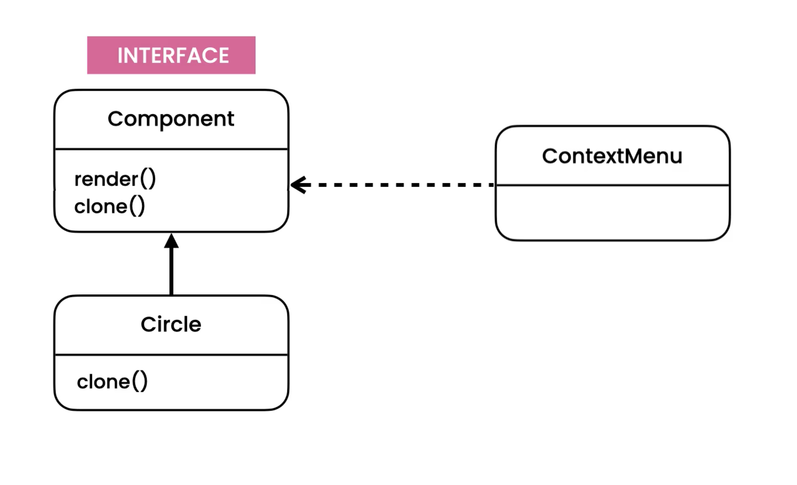

Prototype
=========
* EN: Prototype
* PL: Prototyp
* Type: object

Pattern
-------
* Create new object by copying an existing object

.. literalinclude:: uml/designpatterns-prototype-pattern.md
    :language: md

Problem
-------
* Violates Open/Close Principle

.. literalinclude:: uml/designpatterns-prototype-problem.md
    :language: md

.. literalinclude:: src/designpatterns-prototype-problem.py
    :language: python

Solution
--------

.. literalinclude:: uml/designpatterns-prototype-solution.md
    :language: md

.. literalinclude:: src/designpatterns-prototype-solution.py
    :language: python

Assignments
-----------
Task 1:

    1. Create file ``designpatterns_prototype_a.py``
    2. Create class ``Date`` with:

        * ``year: int``
        * ``month: int``
        * ``day: int``
        * method ``.clone()``

    3. Method ``.clone()`` returns another ``Date`` with the same values

Task 2:

    1. Create file ``designpatterns_prototype_b.py``
    2. Create class ``Time`` with:

        * ``hour: int``
        * ``minute: int``
        * ``second: int``
        * ``microsecond: int``
        * method ``.clone()``

    3. Method ``.clone()`` returns another ``Time`` with the same values

Task 3:

    1. Create file ``designpatterns_prototype_c.py``
    2. Create class ``Dragon`` with:

        * ``name: str``
        * ``health: int`` random from 50 to 100
        * ``gold: int`` random from 1 to 100
        * ``position: tuple[int,int]`` default ``(0, 0)``
        * method ``.clone()``

    3. Method ``.clone()`` returns another ``Dragon`` with the same values

.. todo:: Assignments
          You're building a video editor similar to Adobe Premier.
          The editor contains a timeline of various types of components
          such as text, clips, audio, and so on. The user should be able
          to duplicate any component. The duplicated component should be
          added to the timeline. Look at the implementation of the ContextMenu
          class in the prototype package of the Exercises project. What are
          the problems in the current implementation?Refactor the code using
          the prototype pattern. What have you achieved?
