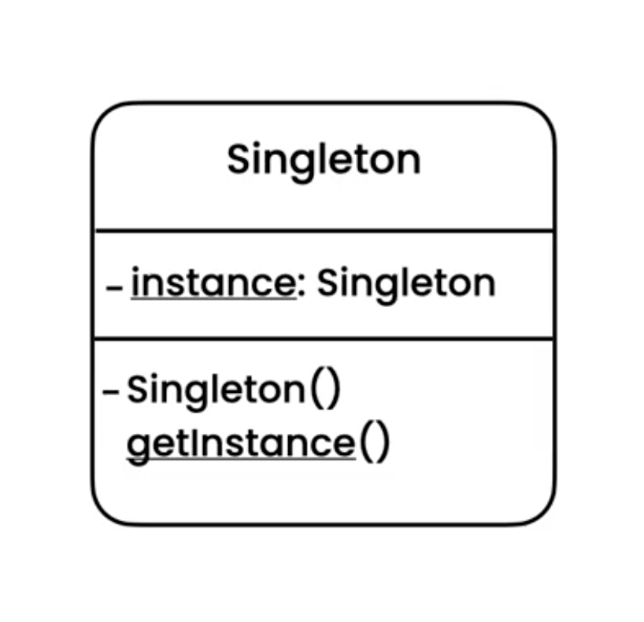
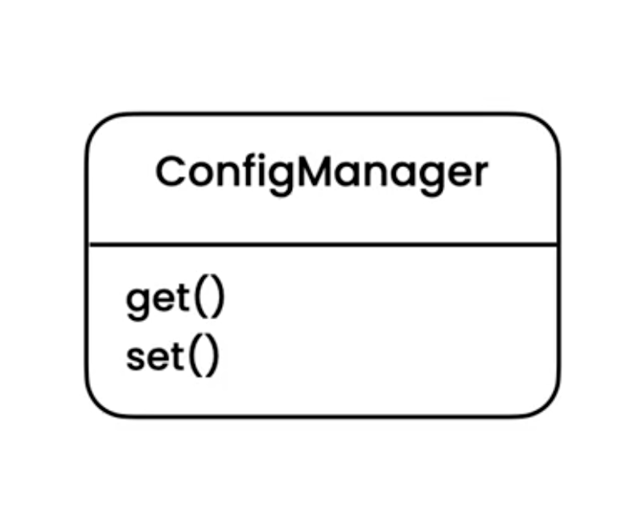
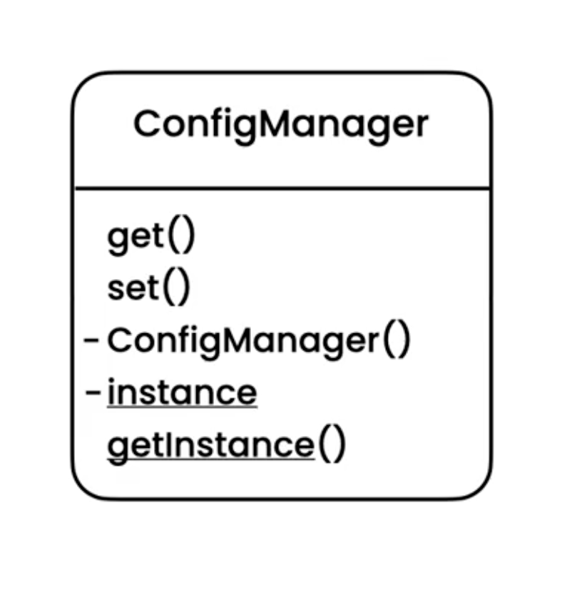

Singleton
=========
* EN: Singleton
* PL: Singleton
* Type: object

Pattern
-------
* To ensure a class has a single instance
* Database connection pool
* HTTP Gateway
* Settings
* Main game/program window

.. literalinclude:: uml/designpatterns-singleton-pattern.md
    :language: md

Problem
-------

.. literalinclude:: uml/designpatterns-singleton-problem.md
    :language: md

.. literalinclude:: src/designpatterns-singleton-problem.py
    :language: python

Solution
--------

.. literalinclude:: uml/designpatterns-singleton-solution.md
    :language: md

.. literalinclude:: src/designpatterns-singleton-solution.py
    :language: python

Use Case - 0x01
---------------
.. literalinclude:: src/designpatterns-singleton-usecase-1.py
    :language: python

Use Case - 0x02
---------------
.. literalinclude:: src/designpatterns-singleton-usecase-2.py
    :language: python

Use Case - 0x03
---------------
.. literalinclude:: src/designpatterns-singleton-usecase-3.py
    :language: python

Use Case - 0x04
---------------
.. literalinclude:: src/designpatterns-singleton-usecase-4.py
    :language: python

Assignments
-----------
Task 1:

* Create file ``designpatterns_singleton_a.py``
* Create singleton class ``Settings``

Task 2:

* Create file ``designpatterns_singleton_b.py``
* Create singleton class ``Logger``

Task 3:

* Create file ``designpatterns_singleton_c.py``
* Create singleton class ``DatabaseConnection``

Task 4:

* Create file ``designpatterns_singleton_d.py``
* Create singleton class ``Queue``
