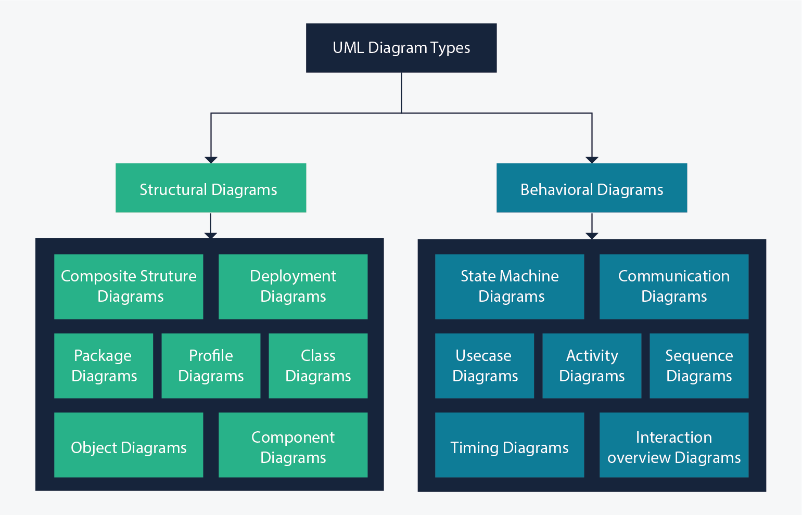
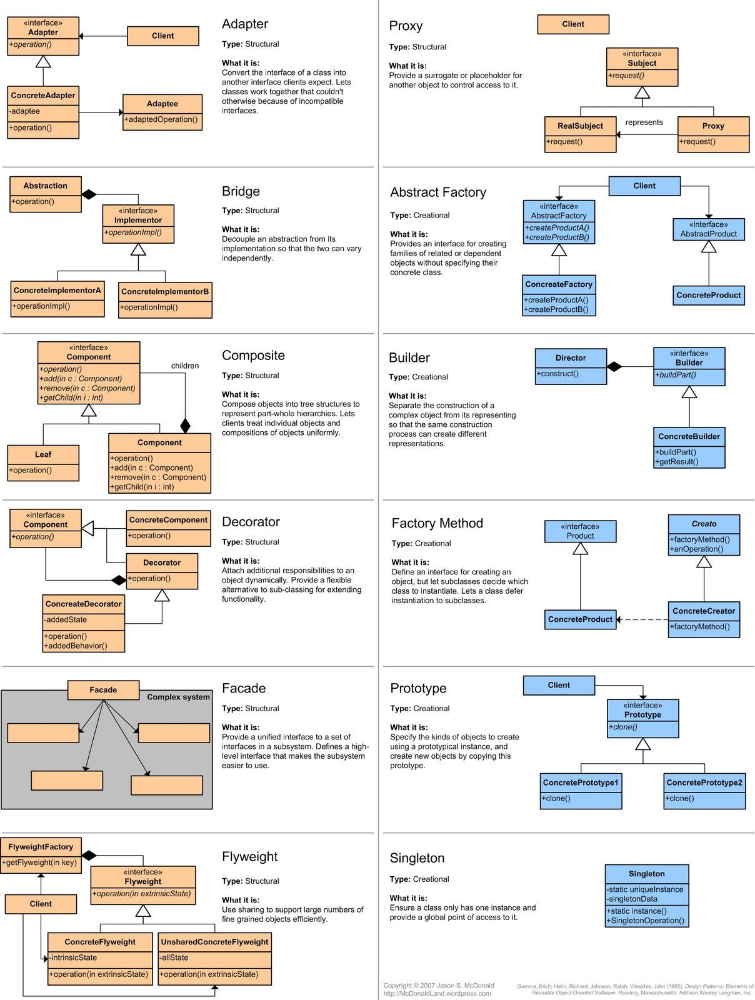
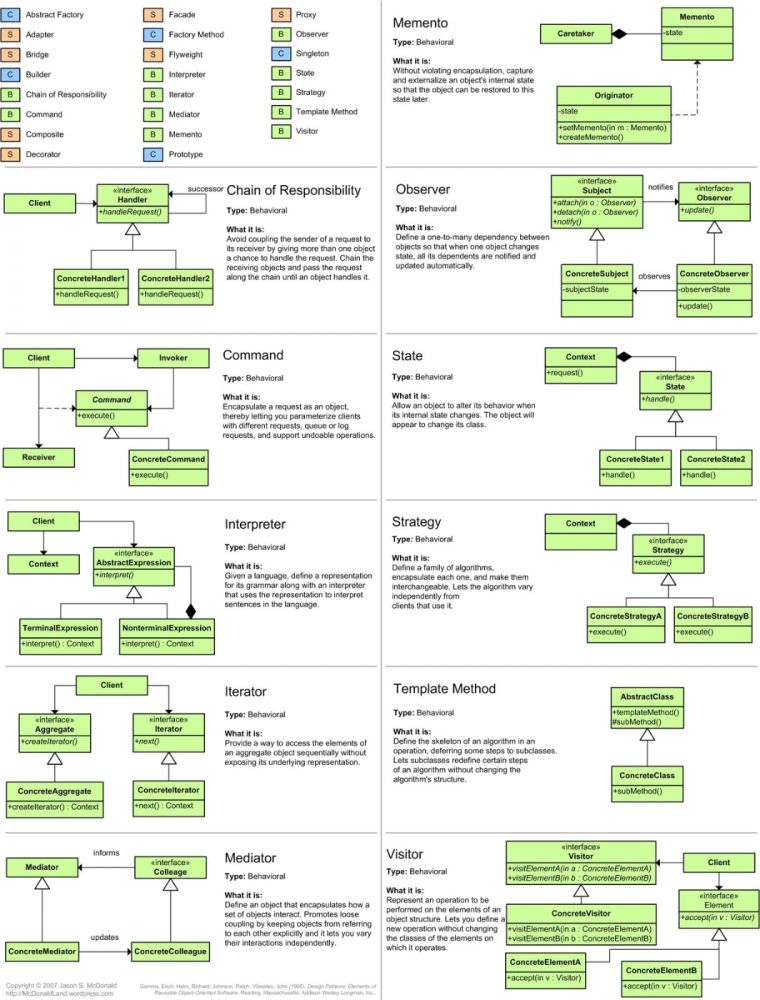
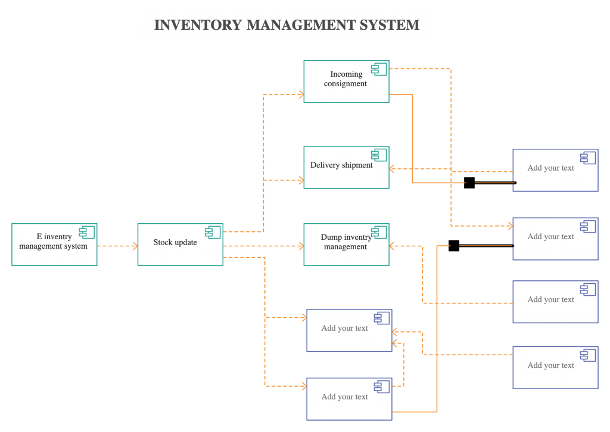
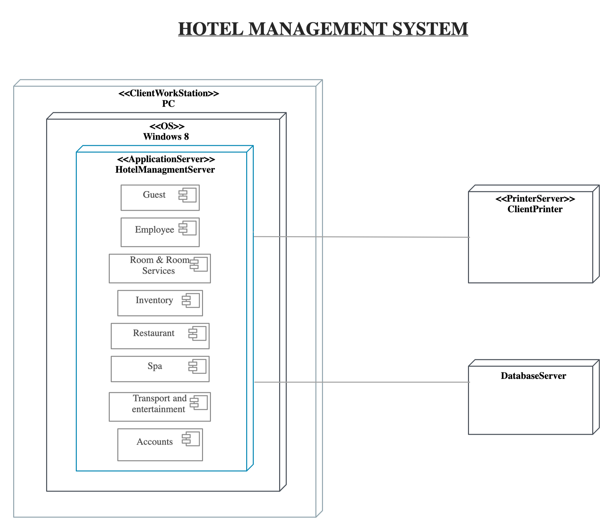
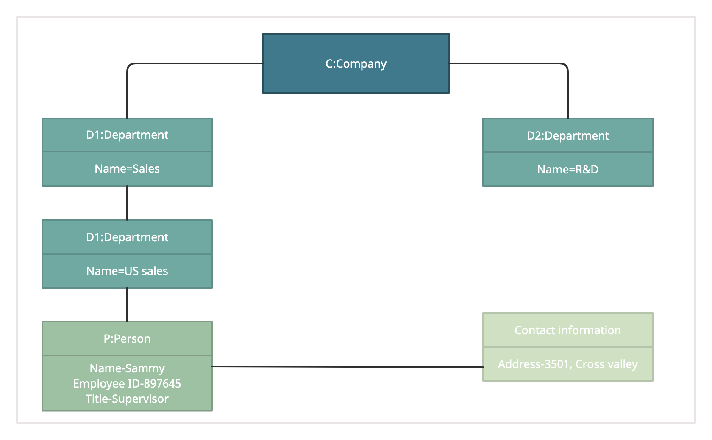
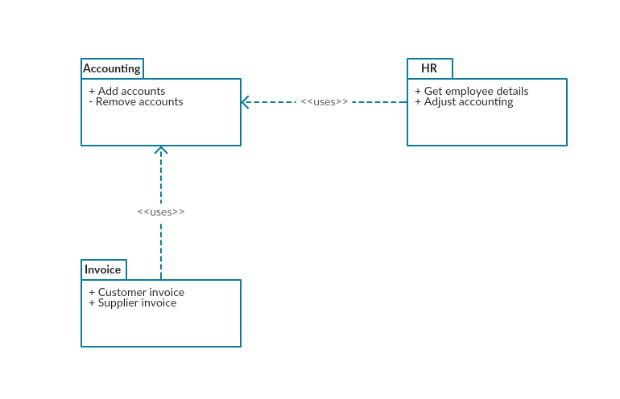
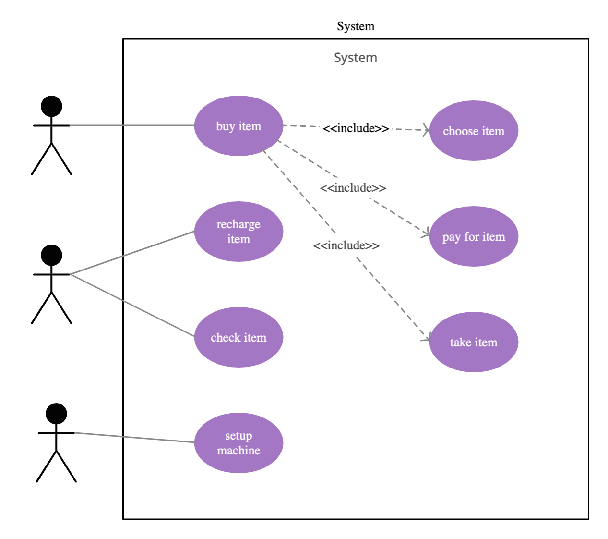
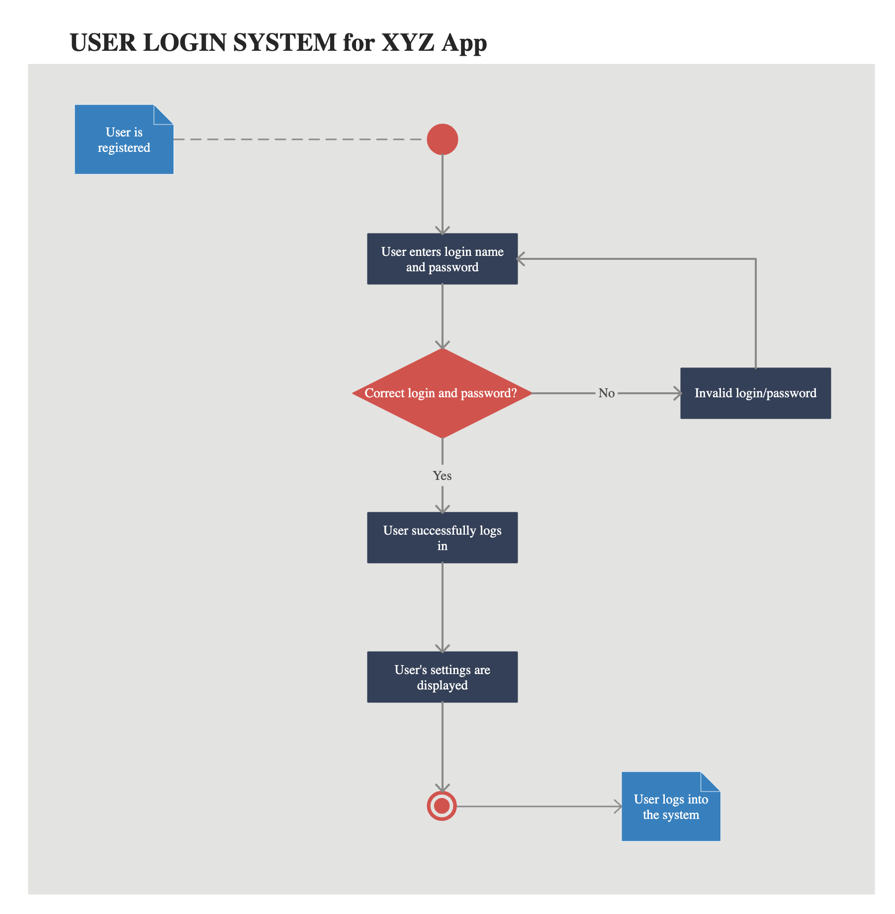
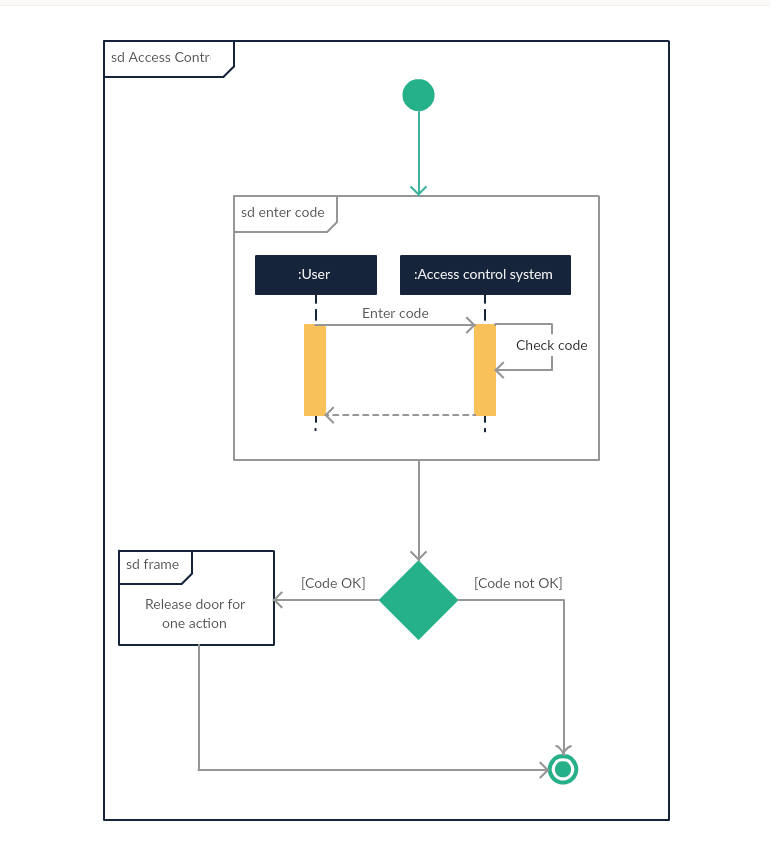

UML About
=========
* Unified Modeling Language
* 14 diagrams
* ERD Diagram

Structure Diagrams:

* Class Diagram
* Component Diagram
* Deployment Diagram
* Object Diagram
* Package Diagram
* Profile Diagram
* Composite Structure Diagram

Behavioral Diagrams:

* Use Case Diagram
* Activity Diagram
* State Machine Diagram
* Sequence Diagram
* Communication Diagram
* Interaction Overview Diagram
* Timing Diagram

    UML Types Diagram [umlDiagrams]_

.. figure:: img/uml-mermaid-classdiagram.png
.. figure:: img/uml-mermaid-sequencediagram-web.png

Rationale
---------

Class Diagram
-------------
* Class relationship

.. figure:: img/uml-diagram-class.jpg

    UML Class Diagram [umlDiagrams]_

.. figure:: img/uml-mermaid-classdiagram.png

Component Diagram
-----------------

    UML Component Diagram [umlDiagrams]_

Deployment Diagram
------------------

    UML Deployment Diagram [umlDiagrams]_

Object Diagram
--------------

    UML Object Diagram [umlDiagrams]_

Package Diagram
---------------

    UML Package Diagram [umlDiagrams]_

Profile Diagram
---------------
.. figure:: img/uml-diagram-profile.jpg

    UML Profile Diagram [umlDiagrams]_

Composite Structure Diagram
---------------------------
.. figure:: img/uml-diagram-composite-structure.jpg

    UML Composite-structure Diagram [umlDiagrams]_

Use Case Diagram
----------------

    UML Use-case Diagram [umlDiagrams]_

Activity Diagram
----------------

    UML Activity Diagram [umlDiagrams]_

State Machine Diagram
---------------------
.. figure:: img/uml-diagram-state-machine.jpg

    UML State-machine Diagram [umlDiagrams]_

Sequence Diagram
----------------
* Conversation over time

.. figure:: img/uml-diagram-sequence.jpg

    UML Sequence Diagram [umlDiagrams]_

.. figure:: img/uml-mermaid-sequencediagram-web.png

Communication Diagram
---------------------
.. figure:: img/uml-diagram-communication.jpg

    UML Communication Diagram [umlDiagrams]_

Interaction Overview Diagram
----------------------------

    UML Interaction-overview Diagram [umlDiagrams]_

Timing Diagram
--------------
.. figure:: img/uml-diagram-timing.jpg

    UML Timing Diagram [umlDiagrams]_

Entity Relationship Diagram
---------------------------
* Entity Relationship
* Database

.. figure:: img/uml-mermaid-erd.png

References
----------
.. [umlDiagrams] UML Diagram Types Guide: Learn About All Types of UML Diagrams with Examples. Year: 2022. Retrieved: 2023-03-13, URL: https://creately.com/blog/diagrams/uml-diagram-types-examples/
