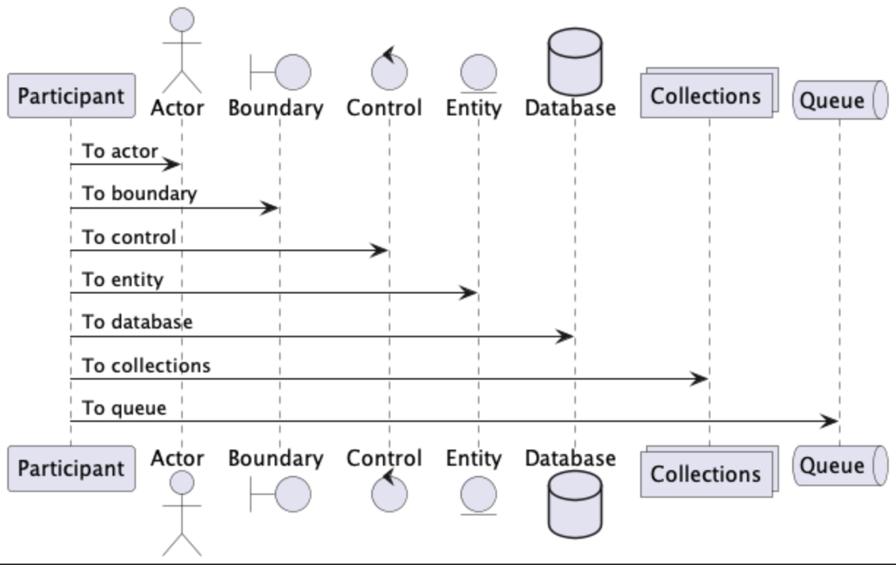

UML PlantUML
============
* ``planUML`` - Markdown extension
* https://plantuml.com/


Class Diagram
-------------
* https://plantuml.com/class-diagram


.. literalinclude:: uml/uml-plantuml-diagram-class.md


Sequence Diagram
----------------

.. literalinclude:: uml/uml-plantuml-diagram-sequence.md


.. literalinclude:: uml/uml-plantuml-diagram-sequence2.png


Gantt
-----

.. literalinclude:: uml/uml-plantuml-diagram-gantt.png


Theming
-------
* https://plantuml.com/theme

.. code-block:: md

    ```plantuml
    !theme plain
    ```


Config
------
* https://plantuml.com/preprocessing
