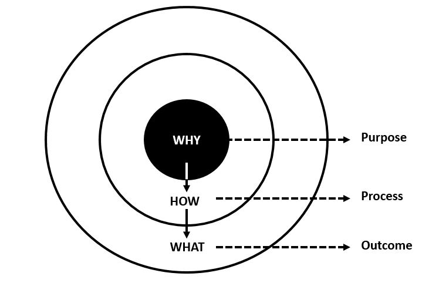

Dragon ADR About
================
* ADR - Architectural Decision Records

An Architectural Decision (AD) is a justified software design choice
that addresses a functional or non-functional requirement that is
architecturally significant. An Architecturally Significant Requirement
(ASR) is a requirement that has a measurable effect on a software system's
architecture and quality. An Architectural Decision Record (ADR) captures
a single AD and its rationale; the collection of ADRs created and maintained
in a project constitute its decision log. All these are within the topic
of Architectural Knowledge Management (AKM), but ADR usage can be extended
to design and other decisions ("any decision record") [#adrgithub]_.

Golden Circle
-------------
* Why? - Your core purpose or belief
* How? - What stands you apart from the competition
* What? - The product or service you provide
* Source []

Segments
--------
* Status - What is the status, such as proposed, accepted, rejected, deprecated, superseded, etc.?
* Problem - What we want to change?
* Motivation - Why we want to change it?
* Consideration - List of options (each option will be described later)
* Options - Options and consequences: pros and cons, examples and use-cases
* Decision - What is the change that we're proposing and/or doing?
* References

References
----------
.. [#adrgithub] Github. Architectural Decision Records. Year: 2023. Retrieved: 2023-03-31. URL: https://adr.github.io/
