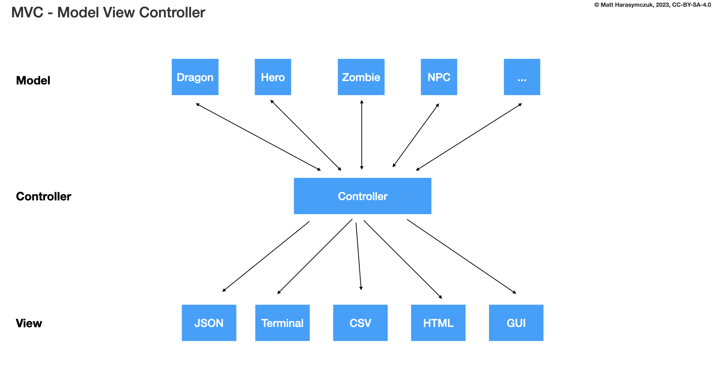
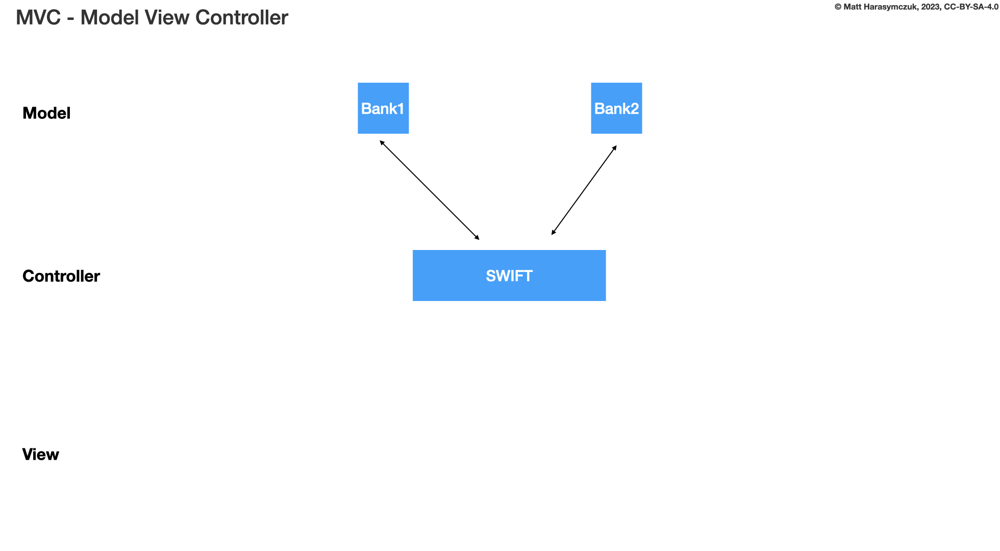

.. testsetup::

    # doctest: +SKIP_FILE

Dragon ADR Position Change
==========================
* ADR - Architecture Design Records

Problem
-------
* Move dragon left by 10 and down by 20
* Move dragon left by 10 and right by 15
* Move dragon right by 15 and up by 5
* Move dragon down by 5

Option 1
--------
>>> dragon.shift(left=10, down=20)
>>> dragon.fly(left=10, down=20)

Pros and Cons:

* Good: extensible to 3D
* Good: move by relative shifting (left, right, up, down)
* Good: encapsulation, object knows current position, state and does the move
* Bad: method names are too use-case specific
* Decision: rejected, method names too use-case specific

Problem:

>>> dragon.fly(left=10, down=20)     # does the same, but different name
>>> hero.walk(left=10, down=20)      # does the same, but different name
>>> snake.slide(left=10, down=20)    # does the same, but different name

Use Cases:

>>> locmem.store(key='...', value='..')
>>> locmem.retrieve(key='...')
>>> database.insert(column='...', value='...')
>>> database.select(column='...')
>>> filesystem.write(filename='...', content='...')
>>> filesystem.read(filename='...')

Option 2
--------
>>> dragon.change_position(left=10, down=20)
>>> dragon.position_change(left=10, down=20)

Pros and Cons:

* Good: extensible to 3D
* Good: move by relative shifting (left, right, up, down)
* Good: encapsulation, object knows current position and moves
* Bad: the method names are a bit too complex for
* Decision: candidate, method names are a bit too complex for now

Option 3
--------
>>> dragon.move(left=10, down=20)
>>> dragon.move(right=10, up=20)
>>> dragon.move(right=10, left=20)

Pros and Cons:

* Good: extensible to 3D
* Good: move by relative shifting (left, right, up, down)
* Good: encapsulation, object knows current position, state and does the move
* Good: hides business logic (inverted y-axis)
* Good: easy ``.move()``
* Good: you can prevent negative shifting (i.e.: ``left=-10``)
* Decision: candidate

Option 4
--------
>>> dragon.move(x=10, y=-20)

Pros and Cons:

* Good: extensible to 3D
* Good: move by relative shifting (left, right, up, down)
* Good: encapsulation, object knows current position, state and does the move
* Good: easy ``.move()``
* Bad: you have to know, which axis is ``left`` and with is ``right``
* Bad: requires knowledge of business logic (inverted y-axis)
* Bad: controller must know other variables, such as speed factor (snail is slower than a dragon), surface on which the dragon is moving (solid is faster than water or ice), injuries (if dragon is not injured with his for example left foot)
* Bad: you cannot prevent negative shifting (i.e.: ``x=-10``)
* Bad: the user must know the internals, how to calculate the position, which way is up or down (positive or negative shifting), note that ``y=-20`` means go up by 20 (we have inverted ``y`` axis)
* Bad: violates abstraction (OOP Principle)
* Bad: violates Tell, Don't Ask (OOP Principle)
* Decision: rejected, it requires to much inside knowledge of API from user

Option 5
--------
>>> dragon.move_to(x=10, y=20)

Pros and Cons:

* Good: extensible to 3D
* Bad: Move by setting absolute position which is similar to ``.set_position()``, but it differs from it where in ``move()`` you can make an animation of movement, and with ``set_position()`` it happens instantly
* Bad: controller must know other variables, such as speed factor (snail is slower than a dragon), surface on which the dragon is moving (solid is faster than water or ice), injuries (if dragon is not injured with his for example left foot)
* Bad: requires knowledge of business logic (inverted y-axis)
* Bad: violates abstraction (OOP Principle)
* Decision: rejected, violates Model-View-Controller (MVC)

Option 6
--------
>>> dragon.move_x(10)
>>> dragon.move_y(-20)

>>> dragon.move_horizontal(10)
>>> dragon.move_vertical(-20)

Pros and Cons:

* Good: extensible to 3D, just add another method
* Bad: require knowledge of an API
* Bad: Move by setting absolute position
* Bad: controller must know other variables, such as speed factor (snail is slower than a dragon), surface on which the dragon is moving (solid is faster than water or ice), injuries (if dragon is not injured with his for example left foot)
* Bad: requires knowledge of business logic (inverted y-axis)
* Bad: the user must know the internals, how to calculate the position, which way is up or down (positive or negative shifting), note that ``y=-20`` means go up by 20 (we have inverted ``y`` axis)
* Bad: violates abstraction (OOP Principle)
* Bad: violates Tell, Don't Ask (OOP Principle)
* Decision: rejected

Option 7
--------
>>> dragon.move_xy(10, -20)

Pros and Cons:

* Bad: Move by setting absolute position
* Bad: controller must know other variables, such as speed factor (snail is slower than a dragon), surface on which the dragon is moving (solid is faster than water or ice), injuries (if dragon is not injured with his for example left foot)
* Bad: the user must know the internals, how to calculate the position, which way is up or down (positive or negative shifting), note that ``y=-20`` means go up by 20 (we have inverted ``y`` axis)
* Bad: requires knowledge of business logic (inverted y-axis)
* Bad: name indicates that this is not extensible to 3D
* Bad: violates abstraction (OOP Principle)
* Bad: violates Tell, Don't Ask (OOP Principle)
* Decision: rejected

Problem:

>>> console.run_command('pwd', True, False, None)

Option 8
--------
>>> dragon.move(10, -20)

Pros and Cons:

* Good: extensible to 3D
* Bad: require knowledge of an API
* Bad: Move by setting absolute position
* Bad: controller must know other variables, such as speed factor (snail is slower than a dragon), surface on which the dragon is moving (solid is faster than water or ice), injuries (if dragon is not injured with his for example left foot)
* Bad: requires knowledge of business logic (inverted y-axis)
* Bad: the user must know the internals, how to calculate the position, which way is up or down (positive or negative shifting), note that ``y=-20`` means go up by 20 (we have inverted ``y`` axis)
* Bad: violates abstraction (OOP Principle)
* Bad: violates Tell, Don't Ask (OOP Principle)
* Decision: rejected

Problem:

>>> run('ls', True, False, None)

Option 9
--------
>>> dragon.move((10, -20))
>>> dragon.move_xy((10, -20))

Pros and Cons:

* Bad: require knowledge of an API
* Bad: Move by setting absolute position
* Bad: controller must know other variables, such as speed factor (snail is slower than a dragon), surface on which the dragon is moving (solid is faster than water or ice), injuries (if dragon is not injured with his for example left foot)
* Bad: the user must know the internals, how to calculate the position, which way is up or down (positive or negative shifting), note that ``y=-20`` means go up by 20 (we have inverted ``y`` axis)
* Bad: requires knowledge of business logic (inverted y-axis)
* Bad: not extensible to 3D
* Bad: violates abstraction (OOP Principle)
* Bad: violates Tell, Don't Ask (OOP Principle)
* Decision: rejected

Problem:

>>> run(('ls', True, False, None))

Option 10
---------
>>> dragon.move(dx=10, dy=-20)
>>> dragon.move(horizontal=10, vertical=-20)

Pros and Cons:

* Good: encapsulation, object knows current position and moves
* Bad: controller computes final offset
* Bad: requires knowledge of business logic (inverted y-axis)
* Bad: the user must know the internals, how to calculate the position, which way is up or down (positive or negative shifting), note that ``y=-20`` means go up by 20 (we have inverted ``y`` axis)
* Bad: violates abstraction (OOP Principle)
* Bad: violates Tell, Don't Ask (OOP Principle)
* Decision: rejected

Option 11
---------
>>> dragon.move(0, 10, 0, -20)

>>> dragon.move((0, 10, 0, -20))

>>> dragon.move([
...     (0, 10, 0, -20),
...     (0, 10, 0, -20)])

Pros and Cons:

* Good: there is only one method ``move()`` responsible for moving
* Bad: Python has keyword arguments, so use it
* Bad: require knowledge of an API
* Bad: not extensible to 3D
* Bad: requires knowledge of business logic (inverted y-axis)
* Bad: the user must know the internals, how to calculate the position, which way is up or down (positive or negative shifting), note that ``y=-20`` means go up by 20 (we have inverted ``y`` axis)
* Bad: violates abstraction (OOP Principle)
* Decision: rejected

Example:

* ``move(left, right, up, down)``

Problem:

>>> run(True, False, None)  # doctest: +SKIP

.. code-block:: css

    p {
        margin-top: 25px;
        margin-bottom: 75px;
        margin-right: 50px;
        margin-left: 100px;
    }

.. code-block:: css

    p {
        margin: 25px 50px 75px 100px;
    }

.. code-block:: css

    p {
        margin: 25px 50px 75px;
    }

.. code-block:: css

    p {
        margin: 25px 50px;
    }

.. code-block:: css

    p {
        margin: 25px;
    }

CSS:

* 4 params: top, right, bottom, left
* 3 params: top, right-left, bottom
* 2 params: top-bottom, right-left
* 1 params: top-right-bottom-left

Option 12
---------
>>> dragon.move([
...     (10, -20),
...     (10, -15)])

Pros and Cons:

* Good: move by relative offset
* Bad: require knowledge of an API
* Bad: not extensible to 3D
* Bad: requires knowledge of business logic (inverted y-axis)
* Bad: the user must know the internals, how to calculate the position, which way is up or down (positive or negative shifting), note that ``y=-20`` means go up by 20 (we have inverted ``y`` axis)
* Bad: violates abstraction (OOP Principle)
* Bad: violates Tell, Don't Ask (OOP Principle)
* Decision: rejected

Example:

* ``move(horizontal, vertical)``

Option 13
---------
>>> dragon.move_to([
...     (10, -20),
...     (50, -120),
...     (5)])

Pros and Cons:

* Bad: move by setting absolute position
* Bad: require knowledge of an API
* Bad: not extensible to 3D
* Bad: requires knowledge of business logic (inverted y-axis)
* Bad: the user must know the internals, how to calculate the position, which way is up or down (positive or negative shifting), note that ``y=-20`` means go up by 20 (we have inverted ``y`` axis)
* Bad: violates abstraction (OOP Principle)
* Bad: violates Tell, Don't Ask (OOP Principle)
* Decision: rejected

Example:

* ``move(x, y)``

Option 14
---------
>>> dragon.move_to({'x':50, 'y':-120})

>>> dragon.move_to([
...     {'x':10, 'y':-20},
...     {'x':10, 'y':-15}])

Pros and Cons:

* Bad: require knowledge of an API
* Bad: not extensible to 3D
* Bad: requires knowledge of business logic (inverted y-axis)
* Bad: the user must know the internals, how to calculate the position, which way is up or down (positive or negative shifting), note that ``y=-20`` means go up by 20 (we have inverted ``y`` axis)
* Bad: violates abstraction (OOP Principle)
* Bad: violates Tell, Don't Ask (OOP Principle)
* Decision: rejected

Option 15
---------
>>> dragon.move({'left':50, 'down':120})

>>> dragon.move([
...     {'left':50, 'down':120},
...     {'left':50, 'right':120},
...     {'down':50}])

Pros and Cons:

* Bad: require knowledge of an API
* Bad: not extensible to 3D
* Bad: requires knowledge of business logic (inverted y-axis)
* Bad: violates abstraction (OOP Principle)
* Bad: **kwargs can convert to keyword arguments
* Decision: rejected

Option 16
---------
>>> dragon.move({'dx': 10, 'dy': 20})

>>> dragon.move([
...     {'dx': -10, 'dy': 20},
...     {'dx': -10, 'dy': 0}])

Pros and Cons:

* Bad: require knowledge of an API
* Bad: not extensible to 3D
* Bad: requires knowledge of business logic (inverted y-axis)
* Bad: the user must know the internals, how to calculate the position, which way is up or down (positive or negative shifting), note that ``dy=-20`` means go up by 20 (we have inverted ``y`` axis)
* Bad: violates abstraction (OOP Principle)
* Bad: violates Tell, Don't Ask (OOP Principle)
* Decision: rejected

Option 17
---------
>>> dragon.move(Point(x=10, y=20))

>>> path = [
...     Point(x=10, y=20),
...     Point(x=10, y=15),
... ]
>>>
>>> dragon.move(path)

Pros and Cons:

* Good: Move by setting absolute position on a path
* Good: This is how they do it in games
* Good: extensible to 3D
* Bad: requires knowledge of business logic (inverted y-axis)
* Bad: require knowledge of an API
* Decision: possible, common practice in game-dev

Option 18
---------
>>> dragon.move([
...     {'direction': 'left', 'distance': 20},
...     {'direction': 'left', 'distance': 10},
...     {'direction': 'right', 'distance': 20}])

Pros and Cons:

* Good: extensible to 3D
* Bad: require knowledge of an API
* Decision: rejected

Option 19
---------
>>> dragon.move([
...     Left(20),
...     Left(10),
...     Right(20)])

Pros and Cons:

* Good: extensible to 3D
* Bad: require knowledge of an API
* Bad: additional entities
* Decision: rejected

Option 20
---------
>>> dragon.move([
...     Direction('left', 20),
...     Direction('left', 10),
...     Direction('right', 20)])

>>> dragon.move([
...     Direction('left', distance=20),
...     Direction('left', distance=10),
...     Direction('right', distance=20)])

Pros and Cons:

* Good: extensible to 3D
* Bad: require knowledge of an API
* Bad: additional entities
* Decision: rejected

Option 21
---------
>>> dragon.position_x -= 10
>>> dragon.position_y += 20

>>> x = dragon.position_x - 10
>>> y = dragon.position_y + 20
>>> dragon.set_position(x=x, y=y)

>>> x = dragon.position_x
>>> y = dragon.position_y
>>> dragon.set_position(x=x-10, y=y+20)

Pros and Cons:

* Good: extensible to 3D, just add ``z`` attribute
* Bad: require knowledge of an API
* Bad: the user must know the internals, how to calculate the position, which way is up or down (positive or negative shifting), note that ``y=-20`` means go up by 20 (we have inverted ``y`` axis)
* Bad: violates abstraction (OOP Principle)
* Bad: violates encapsulation (OOP Principle)
* Bad: violates Tell, Don't Ask (OOP Principle)
* Decision: rejected

Option 22
---------
>>> dragon.move(x=-10, y=+20)
>>> dragon.move(dx=-10, dy=+20)
>>> dragon.change_position(left=-10, down=20)

Pros and Cons:

* Good: extensible to 3D
* Bad: business login in controller
* Bad: the user must know the internals, how to calculate the position, which way is up or down (positive or negative shifting), note that ``dy=-20`` means go up by 20 (we have inverted ``y`` axis)
* Bad: violates abstraction (OOP Principle)
* Bad: violates Tell, Don't Ask (OOP Principle)
* Decision: rejected

Option 23
---------
>>> dragon.move('left', 20)
>>> dragon.move('right', 5)
>>> dragon.move('left', distance=20)
>>> dragon.move('right', distance=5)
>>> dragon.move(direction='left', distance=20)
>>> dragon.move(direction='right', distance=5)

>>> dragon.move('l', 20)
>>> dragon.move('r', 5)
>>> dragon.move('l', distance=20)
>>> dragon.move('r', distance=5)
>>> dragon.move(direction='l', distance=20)
>>> dragon.move(direction='r', distance=5)

Pros and Cons:

* Good: extensible
* Good: extensible to 3D
* Bad: not possible to do movement in opposite directions in the same time
* Decision: rejected

Problem:

>>> plt.plot(x, y, color='cyan')
>>> plt.plot(x, y, color='c')

Usecase:

>>> df.plot(kind='line')
>>> df.interpolate('polynomial')
>>> plt.plot(x, y, color='red')

Option 24
---------
>>> dragon.move_left(10)
>>> dragon.move_right(10)
>>> dragon.move_upright(10)
>>> dragon.move_downright(10)
>>> dragon.move_downleft(10)
>>> dragon.move_upleft(10)
>>> dragon.move_left_down(10, 20)

Pros and Cons:

* Bad: not extensible
* Bad: to complex for now
* Bad: not possible to do movement in opposite directions in the same time
* Decision: rejected, complex

Problem:

>>> db.execute_select(SQL)
>>> db.execute_select_where(SQL)
>>> db.execute_select_order(SQL)
>>> db.execute_select_limit(SQL)
>>> db.execute_select_offset(SQL)
>>> db.execute_select_order_limit(SQL)
>>> db.execute_select_where_order_limit(SQL)
>>> db.execute_select_where_order_limit_offset(SQL)
>>> db.execute_insert(SQL)
>>> db.execute_insert_values(SQL)
>>> db.execute_alter(SQL)
>>> db.execute_alter_table(SQL)
>>> db.execute_alter_index(SQL)
>>> db.execute_create(SQL)
>>> db.execute_create_table(SQL)
>>> db.execute_create_index(SQL)
>>> db.execute_create_database(SQL)

Example:

>>> db.execute(SQL)

Use Case:

>>> read_csv('iris.csv', ';', 'utf-8', True)
>>> read_csv('iris.csv', delimiter=';', encoding='utf-8', verbose=True)

>>> read_csv_with_encoding('iris.csv', 'utf-8')
>>> read_csv_with_delimiter('iris.csv', ';')
>>> read_csv_with_delimiter_encoding('iris.csv', ';', 'utf-8')
>>> read_csv_with_delimiter_encoding_verbose('iris.csv', ';', 'utf-8', True)

>>> file = ReadCSV('iris.csv')  # encapsulation?!
>>> file.set_delimiter(';')
>>> file.set_encoding('utf-8')
>>> file.set_verbose(True)

>>> file = ReadCSV('iris.csv') \
...               .withDelimiter(';') \
...               .withEncoding('utf-8') \
...               .withVerbose(True)

>>> file = read_csv('iris.csv',
...                 delimiter=';',
...                 encoding='utf-8',
...                 verbose=True)

Option 25
---------
>>> LEFT = 0x61  # keyboard key code
>>> RIGHT = 0x62
>>> UP = 0x63
>>> DOWN = 0x64
>>>
>>> dragon.move(direction=LEFT, distance=20)

>>> DIRECTION_LEFT = 0x61  # keyboard key code
>>> DIRECTION_RIGHT = 0x62
>>> DIRECTION_UP = 0x63
>>> DIRECTION_DOWN = 0x64
>>>
>>> dragon.move(direction=DIRECTION_LEFT, distance=20)

Pros and Cons:

* Good: explicit
* Good: verbose
* Good: extensible
* Bad: to chaotic
* Bad: to complex for now
* Bad: there is no easy way to know which are possible directions
* Bad: not possible to do movement in opposite directions in the same time
* Decision: rejected, complex

Option 26
---------
>>> KEY_BINDING = {
...     'ARROW_UP': dragon.move_up,
...     'ARROW_DOWN': dragon.move_down,
...     'ARROW_LEFT': dragon.move_left,
...     'ARROW_RIGHT': dragon.move_right}
>>>
>>>
>>> def action(key, time):
...     return KEY_BINDING.get(key)(time)
>>>
>>>
>>> action('ARROW_UP', 5)

Pros and Cons:

* Good: explicit
* Good: verbose
* Good: extensible
* Good: there is a enumeration of possible choices for directions
* Bad: to complex for now
* Decision: rejected, complex

Option 27
---------
>>> class Direction(IntEnum):
...     LEFT = 0x61
...     RIGHT = 0x62
...     UP = 0x63
...     DOWN = 0x64
>>>
>>>
>>> dragon.move(Direction.LEFT, distance=5)
>>> dragon.move(direction=Direction.LEFT, distance=5)

Pros and Cons:

* Good: explicit
* Good: verbose
* Good: extensible
* Good: ordered
* Good: there is a enumeration of possible choices for directions
* Bad: to complex for now
* Bad: not possible to do movement in opposite directions in the same time
* Decision: rejected, complex

Option 28
---------
>>> class Key(IntEnum):
...     LEFT = 0x61
...     RIGHT = 0x62
...     UP = 0x63
...     DOWN = 0x64
>>>
>>>
>>> game.bind_key(Key.ARROW_LEFT, dragon.move_left)     # good
>>> game.bind_key(Key.ARROW_RIGHT, dragon.move_right)   # good
>>>
>>> game.bind_key(..., dragon.move_downright)           # bad
>>> game.bind_key(..., dragon.move_downleft)            # bad

Pros and Cons:

* Bad: not extensible
* Bad: to complex for now
* Bad: not possible to do movement in opposite directions in the same time
* Decision: rejected, complex

Decision
--------
>>> class Dragon:
...     def move(self, *,
...              left: int = 0, right: int = 0,
...              down: int = 0, up: int = 0,
...              ) -> None: ...
>>>
>>> dragon.move(left=10, down=20)

Pros and Cons:

* Good: easy
* Good: verbose
* Good: extensible (easy to convert to 3D)
* Good: encapsulation

Re-evaluate in future:

>>> class Dragon:
...     def change_position(self, *,
...                         left: int = 0, right: int = 0,
...                         down: int = 0, up: int = 0,
...                         ) -> None: ...
>>>
>>> dragon.change_position(left=10, down=20)

Pros and Cons:

* Good: consistent with ``set_position()`` and ``get_position()``
* Good: verbose
* Good: extensible
* Bad: a bit too complex for now
