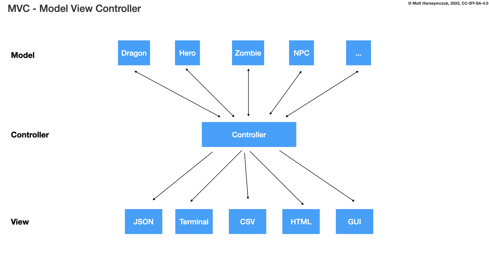
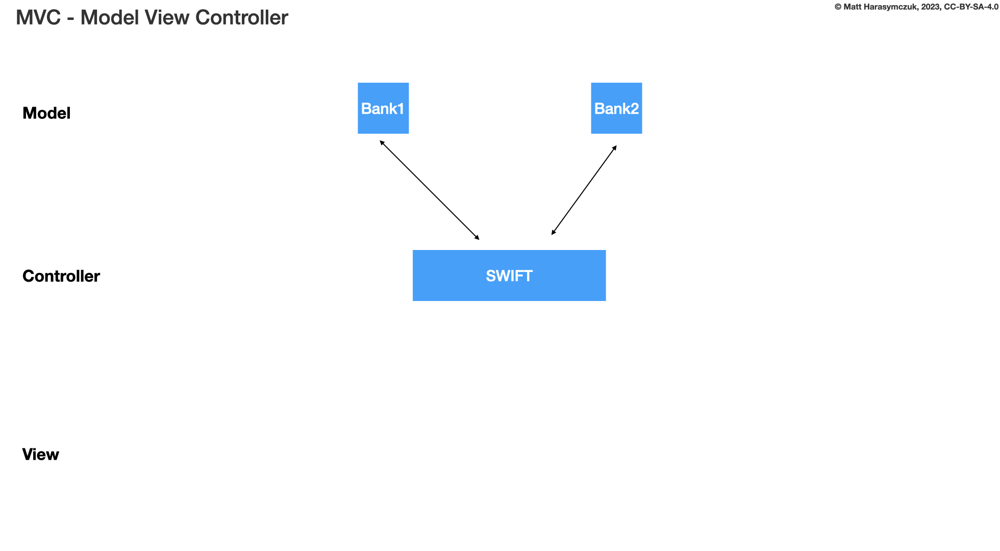

.. testsetup:: # doctest: +SKIP_FILE

ADR Dragon Damage Make
======================
* Dragon makes damage

Option 1
--------
>>> dragon.get_damage()

Pros and Cons:

* Good: easy use
* Good: readability
* Good: clear intent
* Good: easy to add validation if needed
* Bad: name ``get_damage()`` indicate a getter of ``damage`` attribute
* Decision: rejected, bad method name

Option 2
--------
>>> dragon.attack()  # dragon  -> enemy
>>> dragon.hit()     # dragon <-> enemy
>>> dragon.hurt()    # dragon <-  enemy
>>> dragon.damage()  # dragon <-  enemy
>>> dragon.wound()   # dragon <-  enemy

Pros and Cons:

* Bad: Indication of direction is too weak ``dragon <-> enemy``
* Bad: not directed, all methods could mean making damage or receiving damage
* Decision: rejected, bad method names

Example:

>>> dragon.make_damage()    # dragon --> enemy
>>> dragon.attack()         # dragon  -> enemy
>>> dragon.hit()            # dragon <-> enemy
>>> dragon.hurt()           # dragon <-  enemy
>>> dragon.take_damage()    # dragon <-- enemy

Rationale:

Some method names has stronger emphasis on who is making damage to whom.
Consider this: ``dragon.hurt()`` - is that dragon who makes damage or takes
damage?

.. code-block:: text

    dragon --> enemy
    dragon  -> enemy
    dragon <-> enemy
    dragon <-  enemy
    dragon <-- enemy

Option 3
--------
>>> dragon.take_damage()    # dragon <-- enemy

Pros and Cons:

* Good: Simple
* Bad: Relation is other way around ``dragon <-- enemy``
* Decision: rejected, relation is other way around

Option 4
--------
>>> dragon.deal_damage()    # dragon --> enemy
>>> dragon.hurt_someone()   # dragon --> enemy
>>> dragon.attack_enemy()   # dragon --> enemy

Pros and Cons:

* Good: Strong indication of direction ``dragon --> enemy``
* Bad: ``hurt_someone()`` method name is too use-case specific
* Decision: rejected, method names are too use-case specific

Example:

>>> dragon.attack_enemy()  # maybe
>>> magic_arrow.attack_enemy()  # bad
>>> explosion.attack_enemy()  # bad

Option 5
--------
>>> dragon.make_damage()    # dragon --> enemy

Pros and Cons:

* Good: Strong indication of direction ``dragon --> enemy``
* Good: Name indicates intent
* Decision: candidate

Example:

>>> dragon.make_damage()
>>> magic_arrow.make_damage()
>>> explosion.make_damage()

Option 6
--------
>>> dragon.make_damage(ENEMY)    # dragon --> enemy

Pros and Cons:

* Bad: violates Model-View-Controller (MVC)
* Bad: each ENEMY will get different (random) damage
* Decision: rejected, violates Model-View-Controller (MVC)

Use Case:

>>> class BankAccount:
...     def transfer(self, destination_account, amount):
...         self.withdraw(amount)
...         destination_account.deposit(amount)

* Bad: this is not how bank transfers are done (especially between banks)
* Bad: other bank of will not share their source code with you, to make a transfer

>>> def swift_transfer(from_account, to_account, amount):  # controller
...     from_account.withdraw(amount)
...     to_account.deposit(amount)

Rationale:

Option 7
--------
>>> hero.health -= dragon.damage()

Pros and Cons:

* Good: simple
* Good: can use ``@property`` for validation if needed
* Bad: violates encapsulation
* Decision: rejected, violates encapsulation

Option 8
--------
>>> dragon << Damage(20)

Pros and Cons:

* Good: easy to use
* Good: using ``<<`` (lshift) it is easy to add validation
* Bad: require knowledge of an API
* Bad: violates abstraction (OOP Principle)
* Bad: violates encapsulation (OOP Principle)
* Bad: violates Tell, Don't Ask (OOP Principle)
* Decision: rejected, violates OOP principles

Option 9
--------
>>> hero.wound(dragon.hit())

Pros and Cons:

* Bad: readability
* Bad: requires knowledge of API
* Bad: this is responsibility of a controller
* Decision: rejected, violates Model-View-Controller (MVC)

Decision
--------
>>> dmg = dragon.make_damage()

Pros and Cons:

* Good: clear intent
* Good: ``dragon --> enemy``
* Good: readability
* Good: encapsulation

Implementation:

>>> class Dragon:
...     def make_damage(self) -> int: ...
