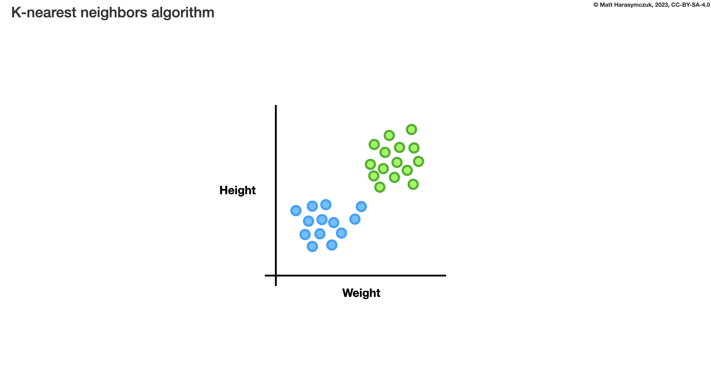
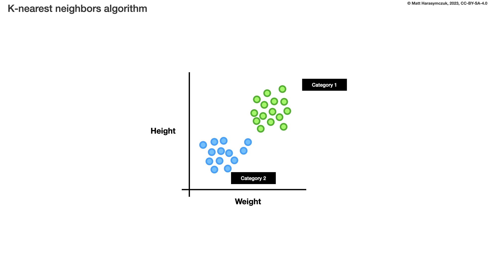
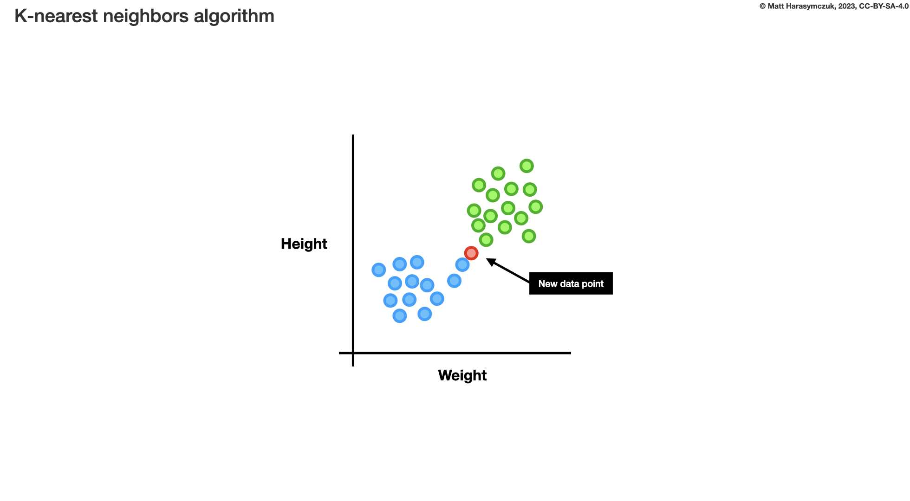
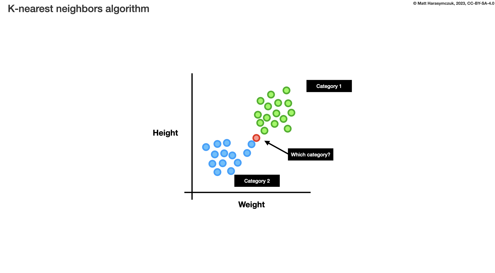
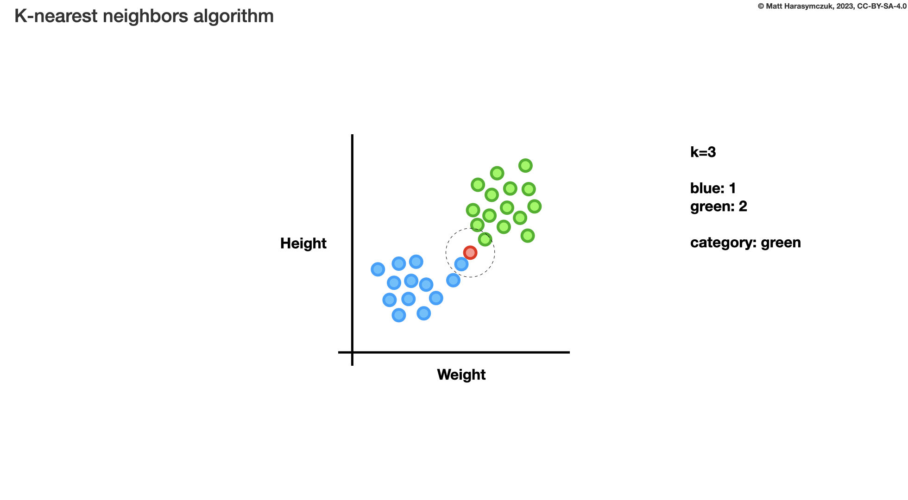
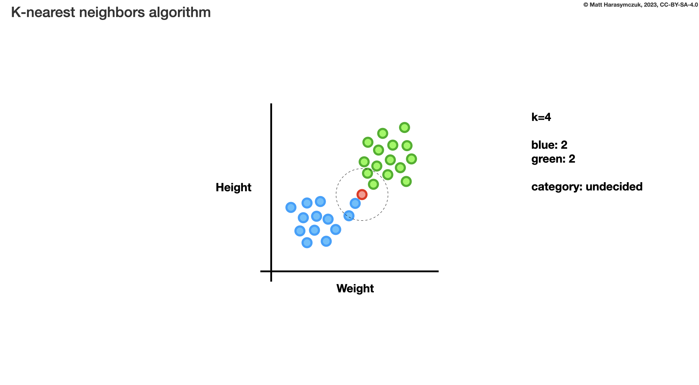
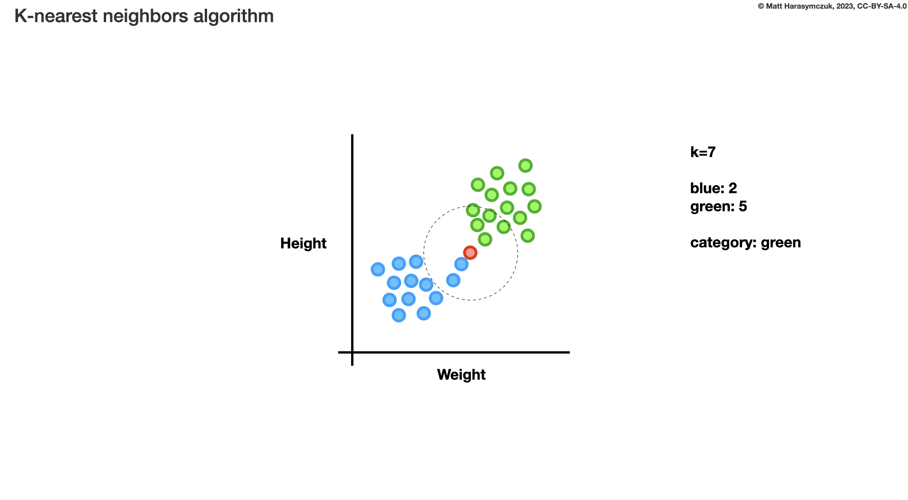

.. testsetup:: # doctest: +SKIP_FILE

Dragon ADR Init Position
========================
* Set Dragon's initial position to x=50, y=120

Option 1
--------
>>> dragon = Dragon('Wawelski', int, int)

Example:

>>> dragon = Dragon('Wawelski', 50, 120)

Pros and Cons:

* Good: easy to use
* Bad: not explicit enough
* Bad: requires knowledge of API to answer what are those numbers
* Bad: It can suggest, that `x` and `y` are gold and hit points
* Bad: It can suggest, that `x` and `y` are width and height of an `texture`
* Bad: Not extensible to 3D
* Decision: rejected, not explicit

Example:

>>> dragon = Dragon('Wawelski', 0, 0)  # 2D
>>> dragon = Dragon('Wawelski', 0, 0, 0)  # 3D
>>> dragon = Dragon('Wawelski', 'img/dragon/alive.png', 0, 0)

>>> dragon = Dragon('Wawelski', None, None)  # default point
>>> dragon = Dragon('Wawelski', 'img/dragon/alive.png', None, None)

Problem:

>>> dragon = Dragon('Wawelski', 0, 0, 'img/dragon/alive.png', 0) # 3D
>>> dragon = Dragon('Wawelski', 0, 0, 'img/dragon/alive.png', None) # 3D

Use Case:

>>> knn = KNearestNeighbors(3)  # ok
>>> knn = KNearestNeighbors(3, [0.75, 0.50, 0.25])  # bad

Option 2
--------
>>> dragon = Dragon('Wawelski', x=int, y=int)

Example:

>>> dragon = Dragon('Wawelski', x=50, y=120)

Pros and Cons:

* Good: easy to use
* Good: short argument names
* Good: verbose in this example
* Good: you can assign ``None`` by default to set default point
* Good: extensible, easy to add ``z`` with default value ``0``
* Good: Extensible to 3D
* Bad: It can suggest, that `x` and `y` are gold and hit points
* Bad: It can suggest, that `x` and `y` are width and height of an `texture`
* Decision: rejected, not explicit enough

Example:

>>> dragon = Dragon('Wawelski', x=0, y=0)
>>> dragon = Dragon('Wawelski', x=0, y=0, z=0)
>>> dragon = Dragon('Wawelski', t='img/dragon/alive.png', x=0, y=0)
>>> dragon = Dragon('Wawelski', t='img/dragon/alive.png', x=0, y=0, z=0)
>>> dragon = Dragon('Wawelski', x=0, y=0, t='img/dragon/alive.png', z=0)

>>> dragon = Dragon('Wawelski', x=None, y=None)
>>> dragon = Dragon('Wawelski', t='img/dragon/alive.png', x=None, y=None)
>>> dragon = Dragon('Wawelski', t='img/dragon/alive.png', x=None, y=None, z=None)

Use Case:

>>> knn = KNearestNeighbors(k=3)  # ok
>>> knn = KNearestNeighbors(k=3, w=[0.75, 0.50, 0.25])  # bad

Option 3
--------
>>> dragon = Dragon('Wawelski', posx=50, posy=120)

Pros and Cons:

* Good: simple, easy to use
* Good: you can assign ``None`` by default to set default point
* Good: extensible, easy to add ``posz`` with default value ``0``
* Good: Extensible to 3D
* Bad: not verbose
* Decision: rejected, not explicit enough

Example:

>>> dragon = Dragon('Wawelski', posx=0, posy=0)  # maybe, bad
>>> dragon = Dragon('Wawelski', posx=0, posy=0, posz=0)  # maybe, bad

Use Case:

>>> knn = KNearestNeighbors(k=3, wgt=[0.75, 0.50, 0.25])  # maybe, bad

Option 4
--------
>>> dragon = Dragon('Wawelski', positionx=50, positiony=120)

Pros and Cons:

* Good: simple, easy to use
* Good: you can assign ``None`` by default to set default point
* Good: extensible, easy to add ``positionz`` with default value ``0``
* Good: Extensible to 3D
* Bad: CamelCase `positionX` and `positionY` does not conform to PEP-8
* Decision: candidate, but names could be better

Example:

>>> dragon = Dragon('Wawelski', positionx=0, positiony=0)  # maybe
>>> dragon = Dragon('Wawelski', positionx=0, positiony=0, positionz=0)  # maybe

Use Case:

>>> knn = KNearestNeighbors(k=3, weights=[0.75, 0.50, 0.25])  # ok

>>> df.plot(kind='line', subplots=True, color='grey', sharey=True)  # bad

Option 5
--------
>>> dragon = Dragon('Wawelski', position_x=50, position_y=120)

Pros and Cons:

* Good: simple, easy to use
* Good: you can assign ``None`` by default to set initial point
* Good: extensible, easy to add ``position_z`` with default value ``0``
* Good: backward compatible
* Good: Extensible to 3D
* Decision: candidate

>>> dragon = Dragon('Wawelski', position_x=0, position_y=0)  # ok
>>> dragon = Dragon('Wawelski', position_x=0, position_y=0, position_z=0)  # ok

Use Case:

>>> df.plot(kind='line', subplots=True, color='grey', share_y=True)       # ok
>>> df.plot(kind='line', sub_plots=True, color='grey', share_y=True)      # overkill

>>> df.plot(kind='line', sub_plots=True, color='grey', share_y_axis=True) # ok
>>> df.plot(kind='line', sub_plots=True, color='grey', share_axis_y=True) # ok

Option 6
--------
>>> dragon = Dragon('Wawelski', (50, 120))
>>> dragon = Dragon('Wawelski', position=(50, 120))

Pros and Cons:

* Good: data is stored together (``x`` and ``y`` coordinates)
* Good: simple, easy to use
* Good: you can assign ``None`` to set default ``position``
* Good: can set only one axis to ``None``
* Good: always has to pass both ``x`` and ``y`` coordinates together
* Bad: always has to pass both ``x`` and ``y`` coordinates together
* Bad: you have to know that first is ``x`` and second is ``y``
* Bad: order is important, you cannot change it
* Bad: unpacking
* Bad: not extensible, ``position`` will always be 2D
* Bad: could be refactored to 3D using regexp: ``pattern = r'[\(\[(\s*?:\d+|None\s*)\s*,\s*(\s*?:\d+|None\s*)[\)\]]'``
* Decision: rejected, not extensible

Example:

>>> dragon = Dragon('Wawelski', (0, 0))              # bad
>>> dragon = Dragon('Wawelski', (0, 0, 0))           # bad
>>> dragon = Dragon('Wawelski', [0, 0])              # bad
>>> dragon = Dragon('Wawelski', [0, 0, 0])           # bad

>>> dragon = Dragon('Wawelski', position=(0, 0))     # maybe
>>> dragon = Dragon('Wawelski', position=(0, 0, 0))  # maybe
>>> dragon = Dragon('Wawelski', position=[0, 0])     # maybe
>>> dragon = Dragon('Wawelski', position=[0, 0, 0])  # maybe

>>> dragon = Dragon('Wawelski', (None, None))                   # bad
>>> dragon = Dragon('Wawelski', (None, None, None))             # bad
>>> dragon = Dragon('Wawelski', position=(None, None))          # bad, maybe
>>> dragon = Dragon('Wawelski', position=(None, None, None))    # bad, maybe

>>> pt = (None, None)
>>> pt = (None, None, None)

>>> pt = (50, 120)
>>> pt = (50, 120, 0)
>>> pt = [50, 120]
>>> pt = [50, 120, 0]

Use Case:

>>> np.random.randint(0, 10, (3, 3))  # bad
>>> np.random.randint(0, 10, size=(3, 3))  # ok

>>> pt = (50, 120)
>>>
>>> pt[0], pt[1]
(50, 120)

>>> x, y = (50, 120)
>>>
>>> x, y
(50, 120)

Option 7
--------
>>> dragon = Dragon('Wawelski', {'x':50, 'y':120})
>>> dragon = Dragon('Wawelski', position={'x':50, 'y':120})

Pros and Cons:

* Good: data is stored together (``x`` and ``y`` coordinates)
* Good: you can assign ``None`` by default to set default point
* Good: order is not important
* Good: always has to pass both ``x`` and ``y``
* Good: possible to extend to 3D with refactoring
* Good: easier to refactor than tuple - ``pattern = r'\{\s*"x"\s*:\s*(?:\d+|None)\s*,\s*"y"\s*:\s*(?:\d+|None)\s*\}'``
* Bad: always has to pass both ``x`` and ``y``
* Bad: unpacking
* Bad: not extensible, ``position`` will always be 2D
* Decision: rejected, not extensible

Example:

>>> dragon = Dragon('Wawelski', {'x':0, 'y':0})         # bad, maybe
>>> dragon = Dragon('Wawelski', {'x':0, 'y':0, 'z':0})  # bad, maybe

>>> dragon = Dragon('Wawelski', position={'x':0, 'y':0})         # maybe
>>> dragon = Dragon('Wawelski', position={'x':0, 'y':0, 'z':0})  # maybe

>>> dragon = Dragon('Wawelski', {'x':None, 'y':None})                     # bad, maybe
>>> dragon = Dragon('Wawelski', {'x':None, 'y':None, 'z':None})           # bad, maybe
>>> dragon = Dragon('Wawelski', position={'x':None, 'y':None})            # bad, maybe
>>> dragon = Dragon('Wawelski', position={'x':None, 'y':None, 'z':None})  # bad, maybe

>>> pt = {'x':None, 'y':None}
>>> pt = {'x':None, 'y':None, 'z':None}

>>> pt = {'x':50, 'y':120}
>>> pt = {'x':50, 'y':120, 'z':0}

Use Case:

>>> pt = {'x':50, 'y':120}
>>>
>>> pt['x']
50
>>> pt['y']
120

Option 8
---------
>>> from collections import namedtuple
>>>
>>>
>>> Position = namedtuple('Point', ['x', 'y'])
>>>
>>> dragon = Dragon('Wawelski', Position(50, 120))
>>> dragon = Dragon('Wawelski', Position(x=50, y=120))
>>> dragon = Dragon('Wawelski', position=Position(50, 120))
>>> dragon = Dragon('Wawelski', position=Position(x=50, y=120))

Pros and Cons:

* Good: data is stored together (``x`` and ``y`` coordinates)
* Good: simple, easy to use
* Good: always has to pass both ``x`` and ``y``
* Good: possible to extend to 3D (Python will crash if ``z`` not found)
* Good: keyword argument is not required, class name is verbose enough
* Good: lightweight, in the end this is a tuple
* Bad: always has to pass both ``x`` and ``y``
* Bad: not extensible, ``position`` will always be 2D
* Decision: rejected, could be done better

Use Case:

>>> pt = Point(x=50, y=120)
>>>
>>> pt[0], pt[1]
(50, 120)
>>>
>>> pt.x, pt.y
(50, 120)

Option 9
--------
>>> from typing import NamedTuple
>>>
>>>
>>> class Position(NamedTuple):
...     x: int
...     y: int
>>>
>>> dragon = Dragon('Wawelski', Position(50, 120))
>>> dragon = Dragon('Wawelski', Position(x=50, y=120))
>>> dragon = Dragon('Wawelski', position=Position(50, 120))
>>> dragon = Dragon('Wawelski', position=Position(x=50, y=120))

Pros and Cons:

* Good: data is stored together (``x`` and ``y`` coordinates)
* Good: simple, easy to use
* Good: verbose
* Good: you can assign ``None`` by default to set default ``position``
* Good: very easy to extend to 3D
* Good: keyword argument is not required, class name is verbose enough
* Good: lightweight, in the end this is a `tuple`
* Decision: candidate

Use Case:

>>> pt = Point(x=50, y=120)
>>>
>>> pt[0], pt[1]
(50, 120)
>>>
>>> pt.x, pt.y
(50, 120)

Option 10
---------
>>> from typing import TypedDict
>>>
>>>
>>> class Position(TypedDict):
...     x: int
...     y: int
>>>
>>> dragon = Dragon('Wawelski', Position(x=50, y=120))
>>> dragon = Dragon('Wawelski', position=Position(x=50, y=120))

Pros and Cons:

* Good: data is stored together (``x`` and ``y`` coordinates)
* Good: simple
* Good: you can assign ``position=None`` by default to set default ``position``
* Good: relatively easy to extend to 3D
* Good: keyword argument is not required, class name is verbose enough
* Bad: ``TypeDict`` does not support default values
* Decision: rejected, better than dict, does not support default values

Use Case:

>>> pt = Point(x=50, y=120)
>>>
>>> pt['x']
50
>>> pt['y']
120

Option 11
---------
>>> from typing import TypedDict, Required, NotRequired
>>>
>>>
>>> class Position(TypedDict):
...     x: Required[int]
...     y: Required[int]
...     z: NotRequired[int]
>>>
>>> dragon = Dragon('Wawelski', Position(x=50, y=120))
>>> dragon = Dragon('Wawelski', position=Position(x=50, y=120))

* Good: data is stored together (``x`` and ``y`` coordinates)
* Good: simple
* Good: you can assign ``position=None`` by default to set default ``position``
* Good: relatively easy to extend to 3D
* Good: keyword argument is not required, class name is verbose enough
* Bad: today we need to make decision, that game will eventually be 3D
* Bad: ``TypeDict`` does not support default values
* Decision: rejected, does not support default values

Use Case:

>>> pt = Point(x=50, y=120)
>>>
>>> pt['x']
50
>>> pt['y']
120

Option 12
---------
>>> class Position:
...     x: int
...     y: int
...
...     def __init__(self, x: int = 0, y: int = 0) -> None:
...         self.x = x
...         self.y = y
>>>
>>>
>>> dragon = Dragon('Wawelski', Position(50, 120))
>>> dragon = Dragon('Wawelski', Position(x=50, y=120))
>>> dragon = Dragon('Wawelski', position=Position(50, 120))
>>> dragon = Dragon('Wawelski', position=Position(x=50, y=120))

Pros and Cons:

* Good: data is stored together (``x`` and ``y`` coordinates)
* Good: very common pattern
* Good: easy to use
* Good: faster than dataclasses
* Good: more explicit than ``dataclass``
* Good: easy to extend to 3D
* Good: can set default values
* Good: keyword argument is not required, class name is verbose enough
* Bad: allows creation of not existing attributes
* Bad: allows for attribute mutation
* Decision: maybe, has some limitation

Use Case:

>>> pt = Point(x=1, y=2)
>>>
>>> pt.x, pt.y
(1, 2)
>>>
>>> pt.x = 10            # ok
>>> pt.y = 20            # ok
>>> pt.notexisting = 30  # ok

Option 13
---------
>>> class Position:
...     __slots__ = ('x', 'y')
...     x: int
...     y: int
...
...     def __init__(self, x: int = 0, y: int = 0) -> None:
...         self.x = x
...         self.y = y
>>>
>>> dragon = Dragon('Wawelski', Position(50, 120))
>>> dragon = Dragon('Wawelski', Position(x=50, y=120))
>>> dragon = Dragon('Wawelski', position=Position(50, 120))
>>> dragon = Dragon('Wawelski', position=Position(x=50, y=120))

Pros and Cons:

* Good: data is stored together (``x`` and ``y`` coordinates)
* Good: common pattern
* Good: easy to use
* Good: more explicit than ``dataclass``
* Good: easy to extend to 3D
* Good: can set default values
* Good: keyword argument is not required, class name is verbose enough
* Good: slots make class lighter and faster
* Bad: too complex for now
* Bad: allows for attribute mutation
* Decision: maybe, too complex for now

Use Case:

>>> pt = Point(x=1, y=2)
>>>
>>> pt.x, pt.y
(1, 2)
>>>
>>> pt.x = 10             # ok
>>> pt.y = 20             # ok
>>> pt.notexisting = 30   # error

Option 14
---------
>>> from dataclasses import dataclass
>>>
>>>
>>> @dataclass
... class Position:
...     x: int
...     y: int
>>>
>>> dragon = Dragon('Wawelski', Position(50, 120))
>>> dragon = Dragon('Wawelski', Position(x=50, y=120))
>>> dragon = Dragon('Wawelski', position=Position(50, 120))
>>> dragon = Dragon('Wawelski', position=Position(x=50, y=120))

Pros and Cons:

* Good: data is stored together (``x`` and ``y`` coordinates)
* Good: simple, easy to use
* Good: verbose
* Good: you can assign ``None`` to set default ``position``
* Good: very easy to extend to 3D
* Good: keyword argument is not required, class name is verbose enough
* Bad: allows creation of not existing attributes
* Bad: allows for attribute mutation
* Decision: maybe, has some limitation

Use Case:

>>> pt = Point(x=1, y=2)
>>>
>>> pt.x, pt.y
(1, 2)
>>>
>>> pt.x = 10             # ok
>>> pt.y = 20             # ok
>>> pt.notexisting = 30   # ok

Option 15
---------
>>> from dataclasses import dataclass
>>>
>>>
>>> @dataclass(frozen=True, slots=True)
... class Position:
...     x: int = 0
...     y: int = 0
>>>
>>> dragon = Dragon('Wawelski', Position(50, 120))
>>> dragon = Dragon('Wawelski', Position(x=50, y=120))
>>> dragon = Dragon('Wawelski', position=Position(50, 120))
>>> dragon = Dragon('Wawelski', position=Position(x=50, y=120))

Pros and Cons:

* Good: data is stored together (``x`` and ``y`` coordinates)
* Good: simple, easy to use
* Good: verbose
* Good: you can assign ``None`` by default to set default ``position``
* Good: very easy to extend to 3D
* Good: keyword argument is not required, class name is verbose enough
* Good: is faster and leaner than simple dataclass
* Good: does not allow for attribute mutation
* Good: does not allow for attribute creation
* Good: slots make class lighter and faster
* Bad: more complicated than mutable dataclasses
* Decision: candidate

Use Case:

>>> pt = Point(x=1, y=2)
>>>
>>> pt.x, pt.y
(1, 2)
>>>
>>> pt.x = 10             # error
>>> pt.y = 20             # error
>>> pt.notexisting = 30   # error

Decision
--------
>>> class Dragon:
...     def __init__(name: str, /, *, position_x: int, position_y: int) -> None:
...         ...
>>>
>>>
>>> dragon = Dragon('Wawelski', position_x=50, position_y=120)

Pros and Cons:

* Good: simple
* Good: explicit
* Good: verbose
* Good: extensible

Future
------
>>> class Dragon:
...     def __init__(name: str, /, *, position: Position) -> None:
...         ...
>>>
>>>
>>> dragon = Dragon('Wawelski', Position(x=50, y=120))

* Choices: ``NameTuple``, ``dataclass(frozen=True, slots=True)``
* Good: explicit
* Good: verbose
* Good: extensible
* Bad: to complicated for now
