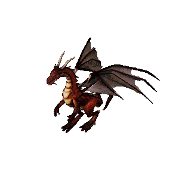

Dragon v5.0
===========
* Assignment: Dragon v5.0
* Complexity: medium
* Lines of code: 50 lines
* Time: 21 min, then 21 min live coding with instructor
* Warning: Don't delete code, assignment will be continued

    Firkraag dragon from game Baldur's Gate II: Shadows of Amn

English
-------
.. todo:: English Translation

Polish
------
Wymagania niefunkcjonalne:

    1. Zapisz (commit) i wypchnij (push) aktualny stan repozytorium
    2. Zmodyfikuj kod gry z poprzedniej wersji zadania
    3. Zapisz kod do rozwiązania zadania w katalogu ``dragon``
    4. Po zakończeniu dodaj wszystkie pliki z ``dragon`` do repozytorium
    5. Zapisz i wypchnij zmiany do centralnego repozytorium (Github)

Wymagania funkcjonalne:

    1. Bohater może należeć do drużyny składającej się maksymalnie z 6 postaci

    2. W grze występuje ekwipunek:

        a. zbroja i tarcza chroni przed uderzeniami obniżając ilość
           obrażeń o wartość obrony,
        b. miecz zwiększa ilość zadawanych obrażeń,

    3. Każdy z przedmiotów ma swoją nazwę, typ oraz modyfikator:

        a. zbroję (dodatkowe punkty obrony, np. +10%)
        b. tarczę (dodatkowe punkty obrony, np. +5%)
        c. miecz (dodatkowe punkty ataku, np. +5%)

    4. Bohater może założyć ekwipunek:

        a. można mieć tylko jedną zbroję i jeden hełm na raz
        b. bohater dowolnej klasy może używać tylko jednego miecza i tarczy
        c. wojownicy mogą używać dwóch mieczy, ale wtedy tarczy już nie

Solution
--------
* EN: Note, that this will spoil your fun and learning
* PL: Zwróć uwagę, że to zepsuje Twoją zabawę i naukę
* :download:`Solution <assignments/dragon_v5.py>`
