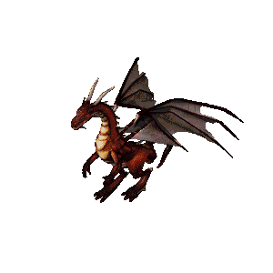

Dragon Sprint 1
===============
* Assignment: Dragon Sprint 1
* Complexity: easy
* Lines of code: 20 lines
* Time: 21 min
* Warning: Don't delete code, assignment will be continued

    Firkraag dragon from game Baldur's Gate II: Shadows of Amn

English
-------
Non-functional requirements:

     1. Commit and push the current state of the repository
     2. Modify the game code from the previous version of the task
     3. Save the code to solve the task in the ``dragon`` directory
     4. When finished, add all files from ``dragon`` to the repository
     5. Commit and push changes to a central repository (Github)

Functional requirements:

    1. Create Dragon with:

        a. Name
        b. Position on the screen

    2. Dragon can:

        a. Have position set to any place on the screen
        b. Move in any direction by specified value

    3. Assume left-top screen corner as an initial coordinates position:

        a. Going right add to ``x``
        b. Going left subtract from ``x``
        c. Going up subtract from ``y``
        d. Going down add to ``y``

    4. Run the game:

        a. Create dragon named "Wawelski"
        b. Set Dragon's initial position to x=50, y=120
        c. Set new position to x=10, y=20
        d. Move dragon left by 10 and down by 20
        e. Move dragon left by 10 and right by 15
        f. Move dragon right by 15 and up by 5
        g. Move dragon down by 5

Polish
------
Wymagania niefunkcjonalne:

    1. Zapisz (commit) i wypchnij (push) aktualny stan repozytorium
    2. Zmodyfikuj kod gry z poprzedniej wersji zadania
    3. Zapisz kod do rozwiązania zadania w katalogu ``dragon``
    4. Po zakończeniu dodaj wszystkie pliki z ``dragon`` do repozytorium
    5. Zapisz i wypchnij zmiany do centralnego repozytorium (Github)

Wymagania funkcjonalne:

    1. Stwórz Smoka
    2. Smok ma:

        a. Nazwą
        b. Pozycją na ekranie

    2. Smok może:

        a. Być ustawiony w dowolne miejsce ekranu
        b. Być przesuwany w którymś z kierunków o zadaną wartość

    3. Przyjmij górny lewy róg ekranu za punkt początkowy:

        a. Idąc w prawo dodajesz ``x``
        b. Idąc w lewo odejmujesz ``x``
        c. Idąc w górę odejmujesz ``y``
        d. Idąc w dół dodajesz ``y``

    4. Scenariusz gry:

        a. Stwórz smoka o nazwie "Wawelski"
        b. Ustaw inicjalną pozycję smoka na x=1, y=2
        c. Ustaw nową pozycję na x=10, y=20
        d. Przesuń smoka w lewo o 10 i w dół o 20
        e. Przesuń smoka w lewo o 10 i w prawo o 15
        f. Przesuń smoka w prawo o 15 i w górę o 5
        g. Przesuń smoka w dół o 5

    5. Pozycja końcowa powinna być: x=20, y=40

Hints
-----
* Shortest solution has 24 lines of code
* It is not a mistake: 'left by 10 and right by 15'
* There are no errors in the assignment (testes on more than 300 trainings)

Solution
--------
* EN: Note, that this will spoil your fun and learning
* PL: Zwróć uwagę, że to zepsuje Twoją zabawę i naukę
* :download:`Solution <assignments/dragon_sprint_1.py>`
