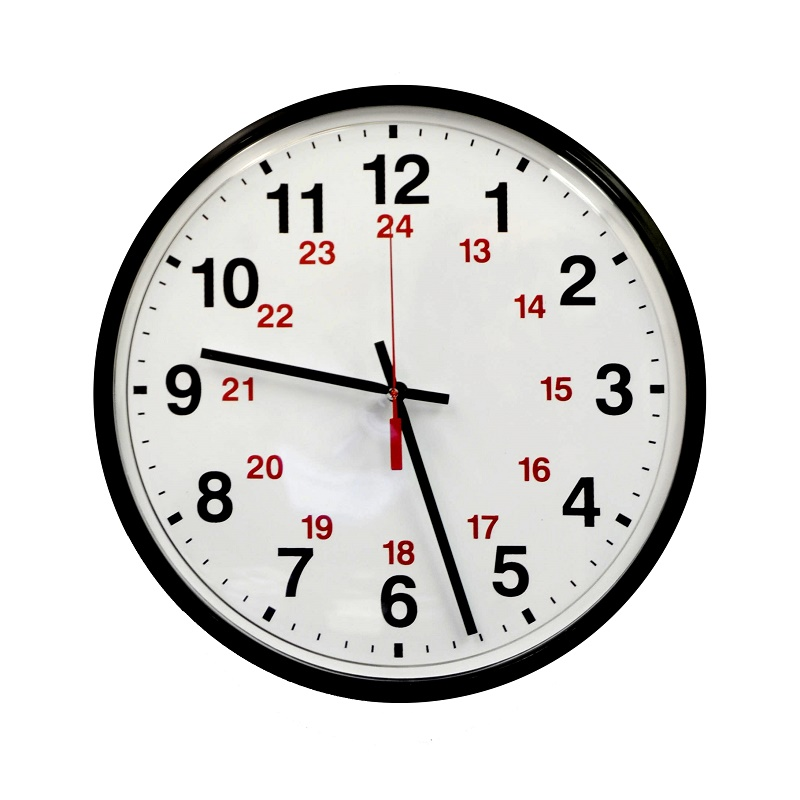
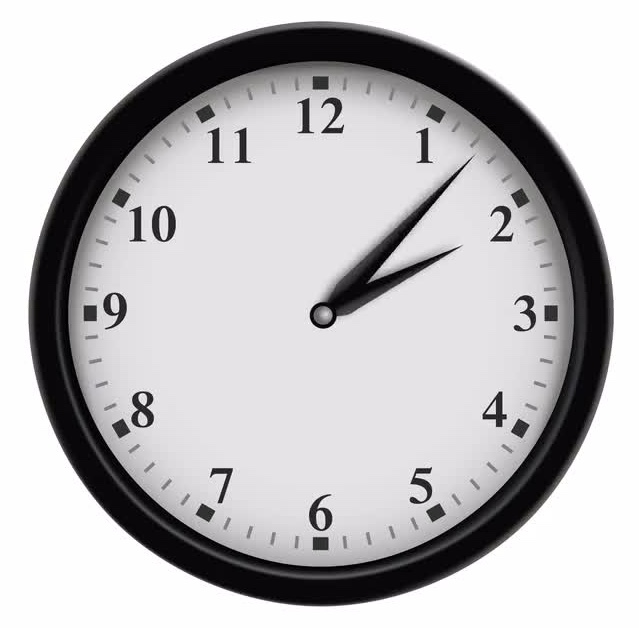
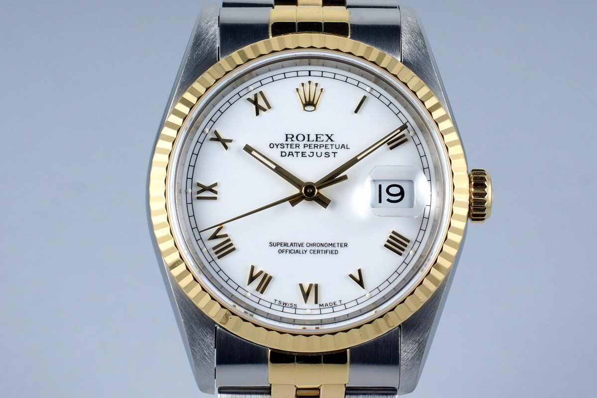
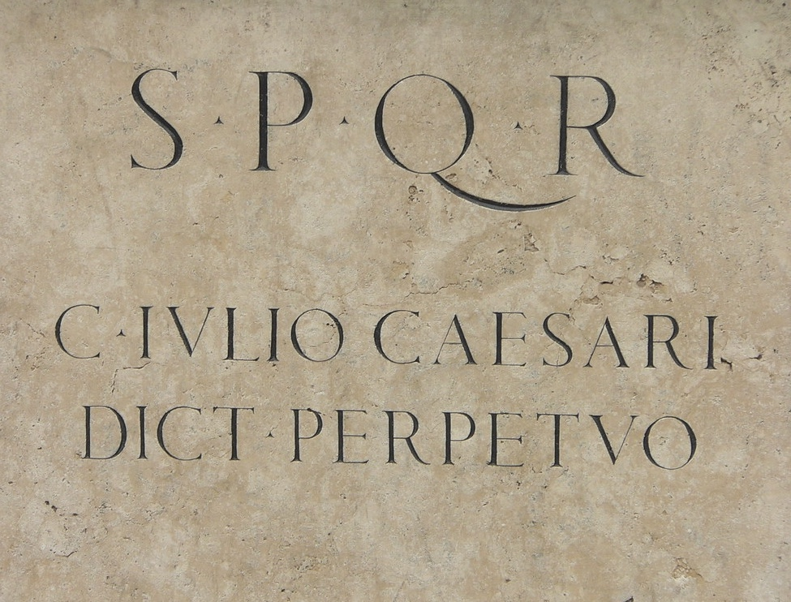
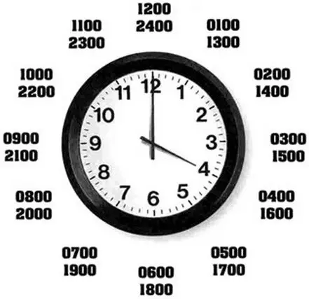

Datetime Standards
==================
* Date and time formats varies from country to country [#wikiDateTimeFormats]_

Date
----
Formal date format in USA [#wikiDateFormatUS]_

.. code-block:: text

    4/12/61         # US short date format
    April 12, 1961  # US long date format

Formal date format in Japan [#wikiDateFormatJapan]_:

.. code-block:: text

    61/04/12        # Japanese short date format
    1961年04月12日   # Japanese long date format

    20/12/31        # Japanese short date format
    平成20年12月31日  # Japanese long date format

Formal date format in Germany:

.. code-block:: text

    12.04.1961      # only date format

Date format in Poland:

.. code-block:: text

    12 kwietnia 1961
    12 kwiecień 1961

    12 IV 1961
    12.IV.1961

    12.4.1961
    12.04.1961

    12/4/1961
    12/04/1961

    12-04-1961
    1961-04-12

Which format is a formal standard in Poland? [#wikiISO8601]_
There is no formal standard for date format in Poland.
There is only a recommendation to write dates using ISO-8601 format (yyyy-mm-dd).
However hardly anyone including government is using it.

24 Hour Clock
-------------
.. code-block:: text

    07:00       # morning
    19:00       # evening

12 Hour Clock
-------------
* What AM stands for?
* What PM stands for?

.. code-block:: text

    7:00 AM     # morning
    7:00 PM     # evening

Noon and Midnight
-----------------
* Confusion at noon and midnight [#wikiNoonMidnight]_
* Which time is a midnight?
* Which time is a noon?

24 hour clock:

.. code-block:: text

    00:00
    12:00

12 hour clock:

.. code-block:: text

    12:00 am
    12:00 pm

Exactly Midnight
----------------
* ``00:00:00.000000`` - day start, exactly midnight
* ``23:59:59.999999`` - day end, excluding last microsecond
* ``24:00:00.000000`` - day end, including last microsecond

Day end, excluding last microsecond:

.. code-block:: text

    start = 2000-01-01 00:00:00.000000
      end = 2000-12-31 23:59:59.999999

Day end, including last microsecond:

.. code-block:: text

    start = 2000-01-01 00:00:00.000000
      end = 2000-12-31 24:00:00.000000

After Midnight
--------------
* Times after Midnight [#wikiTimesAfter2400]_

.. code-block:: text

    23:00 - 25:30   # 23:00-01:30 --> 2h 30m
    14:00 - 26:00   # 14:00-02:00 --> 12h 0m

Leap Second
-----------
* UTC leap second [#wikiLeapSecond]_
* Leap second discontinuation post 2035 [#natureLeapSecond]_
* Issues created by insertion (or removal) of leap seconds
* Calculation of time differences and sequence of events
* Missing leap seconds announcement
* Implementation differences
* Textual representation of the leap second
* Binary representation of the leap second
* Other reported software problems associated with the leap second
* June 30th or December 31st
* Introduced in 1972
* Last leap second in 2016

.. code-block:: text

    23:59:59 -> 00:00:00                # Normal second
    23:59:59 -> 23:59:60 -> 00:00:00    # Leap Second

Zero Padded
-----------
* Zero padded minutes, seconds and microseconds but not hours
* Variable length microseconds

Hours:

.. code-block:: text

    06:07               # ok
    6:07                # ok

Minutes:

.. code-block:: text

    06:07               # ok
    06:7                # error

Seconds:

.. code-block:: text

    06:07:00            # ok
    06:07:0             # error
    06:07:              # error
    06:07               # ok

Microseconds:

.. code-block:: text

    06:07:00.000000     # ok
    06:07:00.00000      # ok
    06:07:00.0000       # ok
    06:07:00.000        # ok
    06:07:00.00         # ok
    06:07:00.0          # ok
    06:07:00            # ok

Microseconds:

.. code-block:: text

    06:07:00.100000     # same time
    06:07:00.10000      # same time
    06:07:00.1000       # same time
    06:07:00.100        # same time
    06:07:00.10         # same time
    06:07:00.1          # same time

    06:07:00.000001     # different time
    06:07:00.00001      # different time
    06:07:00.0001       # different time
    06:07:00.001        # different time
    06:07:00.01         # different time
    06:07:00.1          # different time
    06:07:00            # different time

Roman Numerals
--------------
* In latin ``V`` is read as ``U``
* In latin ``I`` is read as ``J``
* In latin ``IV`` is read as ``JU``
* ``JU`` stands for Jupyter - roman god
* Louis XIV did not like ``IV`` and changed to ``IIII`` [#watchmaster]_
* There is a symetry in groups of four ``I, II, III, IIII``, ``V, VI, VII, VIII``, ``IX, X, XI, XII``

.. code-block:: text

    IV
    IIII

.. code-block:: text

    I,   II,  III,  IIII    # Group with I and I
    V,   VI,  VII,  VIII    # Group with V and I
    IX,  X,   XI,   XII     # Group with X and I

Military Time
-------------
* Military time [#wikiMilitaryTime]_
* Military time zones [#wikiMilitaryTimezones]_

Decimal Time
------------
* Unix time gives date and time as the number of seconds since January 1, 1970
* Microsoft's FILETIME as multiples of 100ns since January 1, 1601 [#wikiMetricTime]_
* VAX/VMS uses the number of 100ns since November 17, 1858 [#wikiMetricTime]_
* RISC OS the number of centiseconds since January 1, 1900 [#wikiMetricTime]_

Other
-----
* Swatch Internet Time - Beats @300 [#wikiSwatchInternetTime]_
* sidereal day on Earth is approximately 86164.0905 seconds (23 h 56 min 4.0905 s or 23.9344696 h)

Calendars
---------
* Julian Calendar [#wikiJulianCalendar]_
* Gregorian Calendar [#wikiGregorianCalendar]_
* Introduced by Pope Gregory XIII in October 1582
* Saudi Arabia was the last country to adopt Gregorian calendar in 2016
* There are only four countries which have not adopted the Gregorian calendar: Ethiopia (Ethiopian calendar), Nepal (Vikram Samvat and Nepal Sambat), Iran and Afghanistan (Solar Hijri calendar)
* List of adoption dates of the Gregorian calendar by country [#wikiGregorianCalendarAdoption]_

.. csv-table:: Brief summary of adoption dates of the Gregorian calendar per country [#wikiGregorianCalendarAdoption]_
    :header: "Year", "Country/-ies/Areas"

    "1582", "Spain, Portugal, France, Polish-Lithuanian Commonwealth, Italy, Catholic Low Countries, Luxembourg, and colonies thereof"
    "1584", "Kingdom of Bohemia, some Catholic Swiss cantons"
    "1610", "Prussia"
    "1648", "Alsace"
    "1682", "Strasbourg"
    "1700", "Protestant Low Countries, Norway, Denmark, some Protestant Swiss cantons"
    "1752", "Great Britain, Ireland, and the 'First' British Empire (1707–1783)"
    "1753", "Sweden and Finland"
    "1873", "Japan"
    "1875", "Egypt"
    "1896", "Korea"
    "1912", "China, Albania"
    "1915", "Latvia, Lithuania"
    "1916", "Bulgaria"
    "1917", "Ottoman Empire"
    "1918", "Ukraine, Russia, Estonia"
    "1919", "Romania, Yugoslavia"
    "1923", "Greece"
    "1926", "Turkey (common era years; Gregorian dates in use since 1917 Ottoman adoption)"
    "2016", "Saudi Arabia"

Astronomy
---------
* Synodic day - the period for a celestial object to rotate once in relation to the star it is orbiting [#wikiSynodicDay]_
* Solar time - calculation of the passage of time based on the position of the Sun in the sky [#wikiSolarTime]_
* Epoch (astronomy) [#wikiEpochAstronomy]_
* Sidereal Time [#wikiSiderealTime]_
* JD - Julian Day [#wikiJulianDay]_

Space Industry
--------------
* UTC - Coordinated Universal Time [#wikiCoordinatedUniversalTime]_
* GMT - Greenwich Mean Time [#wikiGreenwichMeanTime]_
* MET - Mission Elapsed Time
* Relativistic effects
* Time dilatation due to speed approaching speed of light

Planet Mars
-----------
* MSD - Mars Sol Date [#wikiMarsSolDate]_
* MTC - Coordinated Mars Time [#wikiCoordinatedMarsTime]_
* Timekeeping on Mars [#wikiTimekeepingOnMars]_
* Mars Clock [#wikiMarsClock]_
* Martian sidereal day is 24 h 37 m 22.663 s (88,642.663 seconds)
* Martian solar day is 24 h 39 m 35.244 s (88,775.244 seconds)

References
----------
.. [#natureLeapSecond] Gibney, E. The leap second's time is up: world votes to stop pausing clocks. Year: 2022. Retrieved: 2022-11-18. URL: https://www.nature.com/articles/d41586-022-03783-5 DOI: https://doi.org/10.1038/d41586-022-03783-5
.. [#wikiGregorianCalendarAdoption]  Wikipedia. List of adoption dates of the Gregorian calendar by country. Year: 2022. Retrieved: 2022-05-10. URL: https://en.wikipedia.org/wiki/List_of_adoption_dates_of_the_Gregorian_calendar_by_country
.. [#wikiGregorianCalendar]  Wikipedia. Gregorian Calendar. Year: 2022. Retrieved: 2022-05-10. URL: https://en.wikipedia.org/wiki/Gregorian_calendar
.. [#wikiSiderealTime]  Wikipedia. Sidereal Time. Year: 2022. Retrieved: 2022-05-10. URL: https://en.wikipedia.org/wiki/Sidereal_time
.. [#wikiEpochAstronomy]  Wikipedia. Epoch Astronomy. Year: 2022. Retrieved: 2022-05-10. URL: https://en.wikipedia.org/wiki/Epoch_(astronomy)
.. [#wikiJulianDay]  Wikipedia. Julian Day. Year: 2022. Retrieved: 2022-05-10. URL: https://en.wikipedia.org/wiki/Julian_day
.. [#wikiSwatchInternetTime]  Wikipedia. Swatch Internet Time. Year: 2022. Retrieved: 2022-05-10. URL: https://en.wikipedia.org/wiki/Swatch_Internet_Time
.. [#wikiJulianCalendar]  Wikipedia. Julian Calendar. Year: 2022. Retrieved: 2022-05-10. URL: https://en.wikipedia.org/wiki/Julian_calendar
.. [#wikiSolarTime]  Wikipedia. Solar Time. Year: 2022. Retrieved: 2022-05-10. URL: https://en.wikipedia.org/wiki/Solar_time
.. [#wikiSynodicDay]  Wikipedia. Synodic Day. Year: 2022. Retrieved: 2022-05-10. URL: https://en.wikipedia.org/wiki/Synodic_day
.. [#wikiGreenwichMeanTime]  Wikipedia. Greenwich Mean Time. Year: 2022. Retrieved: 2022-05-10. URL: https://en.wikipedia.org/wiki/Greenwich_Mean_Time
.. [#wikiMarsClock]  Wikipedia. Mars Clock. Year: 2022. Retrieved: 2022-05-10. URL: https://marsclock.com/
.. [#wikiCoordinatedUniversalTime]  Wikipedia. Coordinated Universal Time. Year: 2022. Retrieved: 2022-05-10. URL: https://en.wikipedia.org/wiki/Coordinated_Universal_Time
.. [#wikiTimekeepingOnMars]  Wikipedia. Timekeeping On Mars. Year: 2022. Retrieved: 2022-05-10. URL: https://en.wikipedia.org/wiki/Timekeeping_on_Mars
.. [#wikiMarsSolDate]  Wikipedia. Timekeeping On Mars - Mars Sol Date. Year: 2022. Retrieved: 2022-05-10. URL: https://en.wikipedia.org/wiki/Timekeeping_on_Mars#Mars_Sol_Date
.. [#wikiCoordinatedMarsTime]  Wikipedia. Timekeeping On Mars - Coordinated Mars Time. Year: 2022. Retrieved: 2022-05-10. URL: https://en.wikipedia.org/wiki/Timekeeping_on_Mars#Coordinated_Mars_Time
.. [#wikiMetricTime] Wikipedia. Metric time. Leap Second. Year: 2022. Retrieved: 2022-05-10. URL: https://en.wikipedia.org/wiki/Metric_time
.. [#wikiLeapSecond] Wikipedia. Leap Second. Year: 2022. Retrieved: 2022-05-10. URL: https://en.wikipedia.org/wiki/Leap_second
.. [#wikiDateTimeFormats] Wikipedia. Date Time Formats. Year: 2022. Retrieved: 2022-05-10. URL: https://en.wikipedia.org/wiki/Date_format_by_country
.. [#wikiNoonMidnight] Wikipedia. Noon Midnight. Year: 2022. Retrieved: 2022-05-10. URL: https://en.wikipedia.org/wiki/12-hour_clock#Confusion_at_noon_and_midnight
.. [#wikiTimesAfter2400] Wikipedia. Times After 2400. Year: 2022. Retrieved: 2022-05-10. URL: https://en.wikipedia.org/wiki/24-hour_clock#Times_after_24:00
.. [#wikiMilitaryTime] Wikipedia. Military Time. Year: 2022. Retrieved: 2022-05-10. URL: https://en.wikipedia.org/wiki/24-hour_clock#Military_time
.. [#wikiMilitaryTimezones] Wikipedia. Military Timezones. Year: 2022. Retrieved: 2022-05-10. URL: https://en.wikipedia.org/wiki/List_of_military_time_zones
.. [#wikiISO8601] Wikipedia. ISO8601. Year: 2022. Retrieved: 2022-05-10. URL: https://en.wikipedia.org/wiki/ISO_8601
.. [#wikiDateFormatJapan] Date and time notation in Japan. Wikipedia. Year: 2022. Retrieved: 2019-06-27. URL: https://en.wikipedia.org/wiki/Date_and_time_notation_in_Japan#Date
.. [#wikiDateFormatUS] Date and time notation in the United States. Wikipedia. Year: 2022. Retrieved: 2019-06-27. URL: https://en.wikipedia.org/wiki/Date_and_time_notation_in_the_United_States
.. [#watchmaster] Why Do Watches Use the Roman Numeral IIII Instead of IV? Year: 2021. Retrieved: 2023-11-16. URL: https://www.watchmaster.com/en/journal/stories-en/roman-numeral-iiii-on-watches
