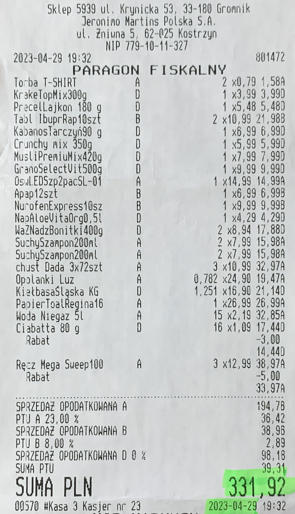

Enum About
==========
* List of finite choices
* Enumerations

Syntax
------
>>> from enum import Enum
>>>
>>>
>>> class Select(Enum):
...     OPTION1 = 1
...     OPTION2 = 2

SetUp
-----
>>> class Color(Enum):
...     RED = '#FF0000'
...     GREEN = '#00FF00'
...     BLUE = '#0000FF'

Switch
------
>>> mycolor = Color('#00FF00')
>>>
>>> mycolor
<Color.GREEN: '#00FF00'>
>>>
>>> mycolor.name
'GREEN'
>>>
>>> mycolor.value
'#00FF00'

Comparison
----------
>>> mycolor = Color('#00FF00')
>>>
>>> mycolor is Color.RED
False
>>>
>>> mycolor is Color.GREEN
True

Iteration
---------
>>> for color in Color:
...     print(color)
Color.RED
Color.GREEN
Color.BLUE

Methods
-------
>>> class Color(Enum):
...     RED = '#FF0000'
...     GREEN = '#00FF00'
...     BLUE = '#0000FF'
...
...     @classmethod
...     def get_favourite(cls):
...         return cls.RED

>>> Color.get_favourite()
<Color.RED: '#FF0000'>

Enum vs Dict
------------
Enum:

>>> class Color(Enum):
...     RED = '#FF0000'
...     GREEN = '#00FF00'
...     BLUE = '#0000FF'
...
>>>
>>> Color.RED
<Color.RED: '#FF0000'>
>>>
>>> Color('#FF0000')
<Color.RED: '#FF0000'>

Dict:

>>> color = {
...     'RED': '#FF0000',
...     'GREEN': '#00FF00',
...     'BLUE': '#0000FF',
... }
>>>
>>> color['RED']
'#FF0000'
>>>
>>> color['#FF0000']
Traceback (most recent call last):
KeyError: '#FF0000'
>>>
>>> tmp = {v:k for k,v in color.items()}
>>> tmp['#FF0000']
'RED'

Use Case - 0x01
---------------
* HTML Colors

>>> class Color(Enum):
...     AQUA = '#00FFFF'
...     BLACK = '#000000'
...     BLUE = '#0000ff'
...     FUCHSIA = '#FF00FF'
...     GRAY = '#808080'
...     GREEN = '#008000'
...     LIME = '#00ff00'
...     MAROON = '#800000'
...     NAVY = '#000080'
...     OLIVE = '#808000'
...     PINK = '#ff1a8c'
...     PURPLE = '#800080'
...     RED = '#ff0000'
...     SILVER = '#C0C0C0'
...     TEAL = '#008080'
...     WHITE = '#ffffff'
...     YELLOW = '#FFFF00'

Use Case - 0x02
---------------
* https://www.euvat.org/vat-returns-poland/
* https://www.infor.pl/akt-prawny/DZU.2019.084.0000816,rozporzadzenie-ministra-finansow-w-sprawie-kas-rejestrujacych.html
* §6 pkt. 5 - Rozporządzenie Ministra Finansów z dnia 29 kwietnia 2019 r. w sprawie kas rejestrujących. Dziennik Ustaw - rok 2019 poz. 816
* PTU - Podatek od Towarów i Usług (Services and Goods Tax)

>>> class PTU(Enum):
...     A = 1.23   # VAT 23%
...     B = 1.08   # VAT 8%
...     C = 1.05   # VAT 5%
...     D = 1.00   # VAT 0%
...     E = None   # VAT Exempt
>>>
>>> PLN = 1

>>> shopping_cart = [
...     {'name': 'Bread',   'price': 3.99*PLN, 'ptu': PTU.C},
...     {'name': 'Butter',  'price': 2.69*PLN, 'ptu': PTU.B},
...     {'name': 'Ham',     'price': 5.99*PLN, 'ptu': PTU.A},
...     {'name': 'Cheese',  'price': 4.19*PLN, 'ptu': PTU.B},
... ]

>>> total = sum(product['price'] * product['ptu'].value
...             for product in shopping_cart)

>>> print(f'Total is: {total:.2f} PLN')
Total is: 18.99 PLN

Use Case - 0x03
---------------
>>> def open(filename, mode):
...     ...
>>>
>>> open('/tmp/myfile.txt', mode=...)

>>> from typing import Literal
>>>
>>> def open(filename: str, mode: Literal['r','w','a']):
...     ...
>>>
>>> open('/tmp/myfile.txt', mode=...)

>>> from enum import StrEnum
>>>
>>> class Mode(StrEnum):
...     READ = 'r'
...     WRITE = 'w'
...     APPEND = 'a'
>>>
>>> def open(filename: str, mode: Mode):
...     ...
>>>
>>> open('myfile.txt', mode=Mode.READ)

More Pythonic way:

>>> def open(filename, read=True, write=False, append=False):
...     ...
>>>
>>> open('myfile.txt', read=True, write=True, append=True)

>>> def open(filename: str, mode: str):
...     ...
>>>
>>> open('myfile.txt', mode='read,write')

.. todo:: Assignments
