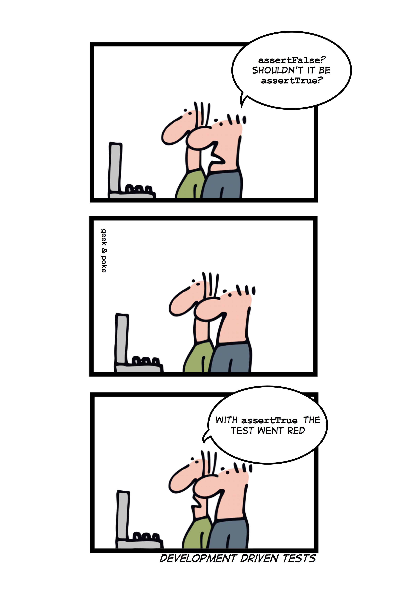

Test Unittest
=============
* https://martinfowler.com/articles/microservice-testing/#testing-component-out-of-process-diagram
* https://docs.python.org/3/library/unittest.mock.html

    Development driven tests

>>> def is_adult(age: int|float) -> bool:
...     if age >= 18:
...         return True
...     else:
...         return False
>>>
>>>
>>> def test_isadult_minor():
...     assert is_adult(10) == False
>>>
>>> def test_isadult_adult():
...     assert is_adult(30) == True
>>>
>>> def test_isadult_almost():
...     assert is_adult(17.99) == False
>>>
>>> def test_isadult_barely():
...     assert is_adult(18.00) == True

Glossary
--------
.. glossary::

    Stub
        A method stub or simply stub in software development is a piece
        of code used to stand in for some other programming functionality.
        A stub may simulate the behavior of existing code (such as a procedure
        on a remote machine) or be a temporary substitute for
        yet-to-be-developed code. Stubs are therefore most useful in porting,
        distributed computing as well as general software development and
        testing.

    Mock
        In object-oriented programming, mock objects are simulated objects
        that mimic the behavior of real objects in controlled ways. In a unit
        test, mock objects can simulate the behavior of complex, real objects
        and are therefore useful when a real object is impractical or
        impossible to incorporate into a unit test.

    Unittest
        In computer programming, unit testing is a software testing method
        by which individual units of source code, sets of one or more computer
        program modules together with associated control data, usage
        procedures, and operating procedures, are tested to determine
        whether they are fit for use.

Running tests with your IDE
---------------------------
* View menu -> Run... -> Unittest in ``myfunction``

From code
---------
.. code-block:: python

    if __name__ == "__main__":
        import unittest
        unittest.main()

From command line
-----------------
Display only errors. With ``-v`` display progress:

.. code-block:: console

    $ python -m unittest myfile.py
    $ python -m unittest -v myfile.py

Methods
-------
* ``self.assertEqual()``
* ``self.assertAlmostEqual(0.1+0.2, 0.3, places=16)``
* ``self.assertTrue()``
* ``self.assertFalse()``
* ``self.assertDictEqual()``
* ``self.assertIn()``
* ``self.assertIs()``
* ``self.assertIsInstance()``
* ``self.assertIsNotNone()``
* ``self.assertRaises()``

Example 1
---------
.. literalinclude:: src/unittest-example-1.py
    :language: python
    :caption: Example ``unittest``

Example 2
---------
.. literalinclude:: src/unittest-example-2.py
    :language: python
    :caption: Example ``unittest``

Example 3
---------
.. literalinclude:: src/unittest-example-3.py
    :language: python
    :caption: Example ``unittest``

Example 4
---------
.. literalinclude:: src/unittest-example-4.py
    :language: python
    :caption: Example ``unittest``

Example 5
---------
.. literalinclude:: src/unittest-example-5.py
    :language: python
    :caption: Example ``unittest``

Example 6
---------
.. literalinclude:: src/unittest-example-6.py
    :language: python
    :caption: Example ``unittest``

Example 7
---------
.. literalinclude:: src/unittest-example-7.py
    :language: python
    :caption: Example ``unittest``

Example 8
---------
.. literalinclude:: src/unittest-example-8.py
    :language: python
    :caption: Example ``unittest``

Example 9
---------
.. literalinclude:: src/unittest-example-9.py
    :language: python
    :caption: Example ``unittest``

Example 10
----------
.. literalinclude:: src/unittest-example-10.py
    :language: python
    :caption: Example ``unittest``

Mock
----
* Mock and MagicMock objects create all attributes and methods as you access them and store details of how they have been used.

.. code-block:: python

    from unittest.mock import MagicMock

    thing = ProductionClass()
    thing.method = MagicMock(return_value=3)

    thing.method(3, 4, 5, key='value')
    # 3

    thing.method.assert_called_with(3, 4, 5, key='value')

Side effect
-----------
* Raising an exception when a mock is called

.. code-block:: python

    from unittest.mock import Mock

    mock = Mock(side_effect=KeyError('foo'))

    mock()
    # Traceback (most recent call last):
    # KeyError: 'foo'

patch
-----
* The object you specify will be replaced with a mock (or other object) during the test and restored when the test ends

.. code-block:: python

    from unittest.mock import patch

    @patch('module.ClassName2')
    @patch('module.ClassName1')
    def test(MockClass1, MockClass2):
        module.ClassName1()
        module.ClassName2()
        assert MockClass1 is module.ClassName1
        assert MockClass2 is module.ClassName2
        assert MockClass1.called
        assert MockClass2.called

    test()

.. code-block:: python

    from unittest.mock import patch

    class MyClass:
        def method(self)
            pass

    with patch.object(MyClass, 'method', return_value=None) as mock_method:
        thing = MyClass()
        thing.method(1, 2, 3)

    mock_method.assert_called_once_with(1, 2, 3)

Stub
----
* writing classes or functions but not yet implementing them
* After you have planned a module or class, for example by drawing it's UML diagram, you begin implementing it.
* As you may have to implement a lot of methods and classes, you begin with stubs.
* This simply means that you only write the definition of a function down and leave the actual code for later.

.. code-block:: python

    class Foo:
         def bar(self):
             raise NotImplementedError

         def tank(self):
             raise NotImplementedError

Use Case - 0x01
---------------
>>> def capture(func, *args, **kwargs):
...     """Return a tuple with the returned exception and value."""
...     try:
...         return [None, func(*args, **kwargs)]
...     except Exception as e:
...         return [type(e), None]
...
>>>
>>>
>>> for x in (-10, -1, 0, 0.2, 100, float('Inf'), float( 'Nan'), 'hello'):
...     assert capture(log, x) == capture(altlog, X)  # doctest: +SKIP

Use Case - 0x02
---------------
>>> device_status = 'Status: connected'
>>> load_limits = False
>>> load = 75
>>> dead_ports = {12, 8, 15, 25}
>>> ports_in_use = {10, 14, 6, 7, 20}
>>> allowed_ports = (2, 3, 4, 5, 6, 7, 8, 9, 10, 12, 14, 16, 18, 20, 22)
>>>
>>>
>>> def is_active(x):
...     """Predicate returning True if x is active port"""
...     return x % 2 == 0

Instead of:

>>> overlap = False
>>> for port in ports_in_use:
...     if port in dead_ports:
...         overlap = True
>>> assert not overlap

Write:

>>> assert not any([port in dead_ports for port in ports_in_use])
>>> assert not any(port in dead_ports for port in ports_in_use)
>>> assert not dead_ports. intersection(ports_in_use)
>>> assert dead_ports.isdisjoint(ports_in_use)

Test objective: Make sure that all the ports in use are under 1024

Bad:

>>> okay = True
>>> for port in ports_in_use:
...     if port >= 1024:
...         okay = False
>>> assert okay

Good:

>>> assert sum( [port < 1024 for port in ports_in_use]) == len(ports_in_use)
>>> assert all([port < 1024 for port in ports_in_use])
>>> assert all(port < 1024 for port in ports_in_use)

Assignments
-----------
.. literalinclude:: assignments/test_unittest_a.py
    :caption: :download:`Solution <assignments/test_unittest_a.py>`
    :end-before: # Solution
